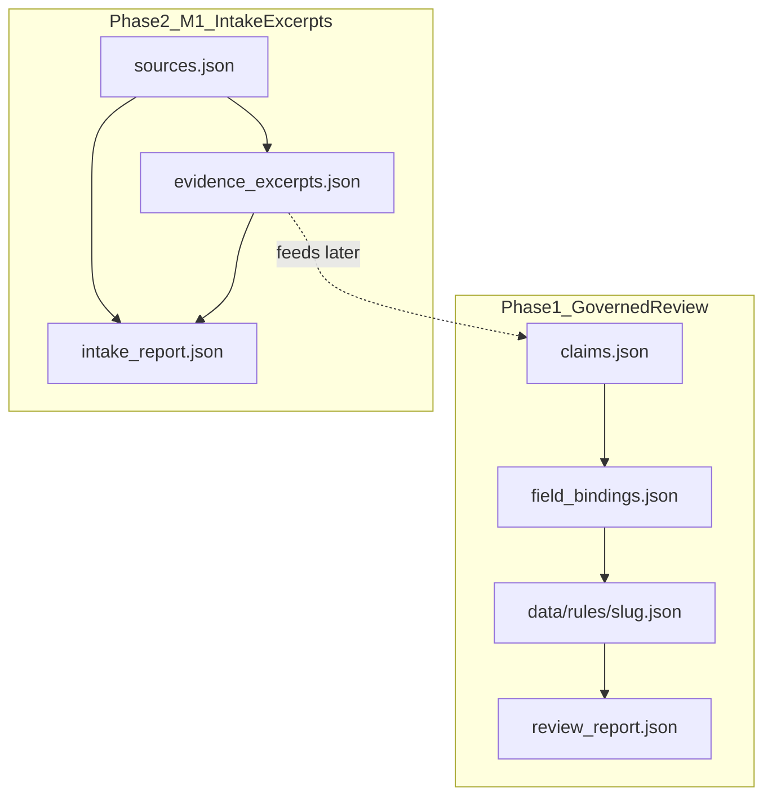

# Governed Country Pipeline — Phase 2 Milestone 1

**Branch:** `claude/governed-country-pipeline-p2-m1`  
**Status:** PLAN ONLY — awaiting architectural and governance review before implementation  
**Base:** `main` @ Phase 1 merge (`8575cce2…` / PR #62)  
**Date:** 2026-07-30

---

## 1. Purpose

Close the next slice of executive debt after Phase 1’s **Governed Review Pipeline**.

Phase 2 Milestone 1 builds the **Structured Source Intake → Evidence Excerpts → Validation** loop only.

Governing rule:

> Evidence excerpts preserve what the source says; they do not decide what the project may claim.

This milestone produces auditable evidence objects. It does **not** produce claims, drafts, or publication decisions.

---

## 2. Explicit non-goals (hard boundaries)

Milestone 1 must **not**:

| Forbidden | Reason |
|---|---|
| Claim extraction | Claims remain Phase 2 Milestone 2+ |
| Claim matrix edits driven by intake automation | Human/controlled matrix revision only |
| Draft / `data/rules/{slug}.json` generation | Phase 1 review consumes drafts; M1 does not create them |
| Field-binding generation | Depends on claims |
| Publication lifecycle changes (`page_status`, `evidence_tier`) | Human-gated |
| Indexing changes (`indexing_allowed`) | Human-gated |
| Automatic PR creation | Out of scope |
| Live network crawling as a CI requirement | CI stays offline/deterministic; fetch may be an optional operator tool later |
| Semantic “what we may assert” inference from excerpts | Violates claim-neutrality |

If an implementation PR touches any of the above, it is out of milestone scope and must be rejected or split.

---

## 3. Success criterion (true closed loop for M1)

```text
Official source
  → normalized source record
  → bounded evidence excerpts
  → provenance + pinpoint metadata
  → deterministic validation
  → PASS / BLOCK
```

A country pack passes M1 when its intake artifacts validate with **decision: PASS** and no blocking claim-neutrality or provenance defects.

---

## 4. Required per-country outputs

Under the existing pack root (extend Phase 1 layout; do not invent a second country tree):

```text
data/coverage/pipeline/{slug}/
  sources.json              # normalized official source records (extend Phase 1 shape)
  evidence_excerpts.json    # NEW — bounded excerpts with provenance/pinpoint
  intake_report.json        # NEW — PASS/BLOCK for intake+excerpts validation
  # Phase 1 artifacts may coexist but are out of M1 mutation scope:
  claims.json               # read-only for M1 (optional cross-check later)
  field_bindings.json       # untouched
  review_report.json        # Phase 1 review output; untouched by M1
```

Minimum required for M1 completeness:

1. `sources.json`
2. `evidence_excerpts.json`
3. `intake_report.json`

Brazil is the pilot pack (already has Phase 1 `sources.json`). M1 adds excerpts + intake report and extends source metadata only as needed for intake validation.

---

## 5. Relationship to Phase 1



- Phase 1 continues to validate claim-bound drafts.
- M1 validates **intake evidence quality** upstream of claims.
- No automatic wire from excerpts → claims in this milestone.
- Future Milestone 2 may consume `evidence_excerpts.json` as the only allowed quote/provenance substrate for new/updated claims.

---

## 6. Artifact contracts (proposed)

### 6.1 `sources.json` (normalized source record)

Extend Phase 1 source objects. Required fields for M1:

| Field | Purpose |
|---|---|
| `source_id` | Stable ID (`SRC-XX-…`) |
| `label` | Human label |
| `url` | Canonical HTTPS URL |
| `type` | `rules_schema` source type |
| `tier` | `primary` / secondary tiers already known |
| `currency` | `current` \| `superseded` \| `unknown` \| `historical` |
| `authority` | Official institution / instrument name |
| `accessed_at` | ISO date of last human/operator access check |
| `verified_at` | ISO date of last content verification (may equal `accessed_at`) |
| `authority_kind` | e.g. `central_bank`, `customs`, `legislature_publication`, `ministry` |
| `jurisdiction` | ISO2 / country scope |

Optional but recommended:

| Field | Purpose |
|---|---|
| `superseded_by` | Successor `source_id` when `currency=superseded` |
| `language` | Source language |
| `document_title` | Official title |
| `effective_date` / `published_date` | When known |
| `retrieval_method` | `manual` \| `operator_fetch` (not CI-live) |
| `notes` | Non-claim narrative |

**Rule:** A `superseded` source may exist for audit. It may be referenced by an excerpt only if the excerpt explicitly declares `allows_superseded: true` **and** the intake report flags `needs_human_review`. Default: excerpts must bind to `currency=current` sources.

### 6.2 `evidence_excerpts.json`

Top-level:

```json
{
  "schema_version": "1.0.0",
  "country_slug": "brazil",
  "excerpts": []
}
```

Each excerpt object (minimum):

| Field | Purpose |
|---|---|
| `excerpt_id` | Stable ID (`EX-BR-…`) |
| `source_id` | Must exist in `sources.json` |
| `excerpt_text` | Bounded quotation or faithful extract of what the source says |
| `excerpt_language` | Language of `excerpt_text` |
| `pinpoint` | Object locating the text in the source |
| `provenance` | How/when the excerpt was captured |
| `claim_neutral` | Must be `true` (asserted by author; enforced by validator heuristics) |
| `topics` | Optional tags (`cash_declaration`, `fx_regime`, …) — not claims |

`pinpoint` minimum (at least one locator filled):

```json
{
  "article": "Art. 14 §1-I",
  "section": null,
  "heading": null,
  "page": null,
  "url_fragment": null,
  "locator_note": "Receita Federal entry guidance — declaration threshold paragraph"
}
```

`provenance` minimum:

```json
{
  "captured_at": "2026-07-30",
  "captured_by": "operator",
  "method": "manual_copy",
  "source_accessed_at": "2026-07-30"
}
```

**Claim-neutrality constraints on `excerpt_text`:**

- Prefer source-language quotation or close paraphrase marked as extract.
- Forbidden patterns in excerpt text (validator BLOCK):
  - project rule voice (“travellers must…”, “Brazil operates…”) unless that exact normative sentence appears as a **quoted** official statement and is wrapped/flagged as quotation
  - ConvertCCY field names / lifecycle language
  - wording that asserts `verified` / `bounded` / evidence grades
  - synthesis across multiple sources in one excerpt (one excerpt = one source)

Ambiguity or multi-interpretation source language → record in `intake_report.needs_human_review`, do **not** resolve into a claim.

### 6.3 `intake_report.json`

Generated by the M1 validator/orchestrator:

```json
{
  "schema_version": "1.0.0",
  "country_slug": "brazil",
  "decision": "PASS",
  "blocking_findings": [],
  "improvement_findings": [],
  "needs_human_review": [],
  "stats": {
    "sources_total": 0,
    "sources_current": 0,
    "sources_superseded": 0,
    "excerpts_total": 0
  },
  "summary": "INTAKE PASS | BLOCKED BY N FINDING(S)"
}
```

Finding shape mirrors Phase 1 review findings: `layer`, `field`, `reason`, `required_action`, `blocking`.

Suggested layers for M1:

- `structural` — schema/shape/IDs
- `provenance` — access/verify dates, pinpoint completeness
- `authority` — official identity, type/tier coherence
- `currency` — superseded misuse
- `neutrality` — claim-shaped language / multi-source synthesis
- `governance` — milestone boundary violations (e.g. pack also mutating rules lifecycle)

---

## 7. Validator requirements

New script (proposed name): `scripts/validate_source_intake.py`

Also extend `scripts/pipeline_schema.py` with M1 constants/paths **without** breaking Phase 1 pack discovery.

### Checks (blocking unless noted)

1. **Source identity & authority**
   - Required identity fields present
   - `authority` non-empty
   - `type` ∈ `VALID_SOURCE_TYPES`
   - primary types consistent with `tier=primary` expectations from policy

2. **URL & currency**
   - HTTPS URL
   - `currency` valid
   - `superseded` ⇒ `superseded_by` present and resolvable (warn→block if missing)
   - No excerpt binds a superseded source unless explicitly allowed + human-review flagged

3. **Access / verification dates**
   - `accessed_at` / `verified_at` present and parseable (ISO date)
   - Improvement (non-blocking): stale beyond policy threshold (e.g. >180 days) → warn + human-review candidate

4. **Excerpt ↔ source integrity**
   - Every excerpt has `source_id`
   - No orphan `source_id`
   - No excerpt without pinpoint locator
   - No empty `excerpt_text`

5. **Claim-neutrality**
   - Heuristic BLOCK list for claim/rule voice and lifecycle terms
   - One source per excerpt
   - Optional: forbid embedding Claim IDs (`BR-…`) inside excerpt text

6. **Conflict / ambiguity routing**
   - `sources.source_conflicts` non-empty ⇒ `needs_human_review` (+ warn or block per policy)
   - Excerpt marked `ambiguous: true` ⇒ human-review trigger

7. **Milestone boundary**
   - Validator must not require claims/bindings/rules to PASS M1
   - Validator must not flip or demand publication readiness

CI proposal:

- Keep Phase 1: `python3 scripts/validate_country_pipeline.py`
- Add M1: `python3 scripts/validate_source_intake.py`  
  - Runs for packs that contain `evidence_excerpts.json` (opt-in), **or** for all packs once Brazil pilot lands
  - Offline only

Orchestrator proposal (thin):

```text
python scripts/country_pipeline.py intake-review <slug>
```

Writes/refreshes `intake_report.json`. No `fix` that invents excerpt text.

---

## 8. Policy additions (executable)

Extend `data/governance/country_pipeline_policy.json` with an `intake` section, e.g.:

```json
{
  "intake": {
    "required_artifacts": ["sources.json", "evidence_excerpts.json", "intake_report.json"],
    "excerpt_requires_current_source": true,
    "allow_superseded_excerpt_with_human_review": true,
    "require_pinpoint": true,
    "require_accessed_at": true,
    "require_verified_at": true,
    "claim_neutrality_enforced": true,
    "stale_source_warn_days": 180,
    "forbidden_excerpt_patterns": [
      "page_status",
      "indexing_allowed",
      "evidence_tier",
      "verification_target",
      "largely liberalised"
    ]
  }
}
```

Exact pattern list to be finalized in implementation PR after governance review of this plan.

---

## 9. Brazil pilot expectations (implementation phase, not this plan commit)

When implementation is approved:

1. Extend Brazil `sources.json` with `accessed_at` / `verified_at` / authority metadata for current sources.
2. Add `evidence_excerpts.json` for the **already-trusted** official anchors only (Lei 14.286 articles used in draft, Receita entry/exit passages, Res. 277 Art. 29 / 69–70 locators, BCB Política cambial regime statement if quotable).
3. Generate `intake_report.json` via validator.
4. Do **not** rewrite `claims.json`, `field_bindings.json`, or `data/rules/brazil.json` in the M1 implementation PR unless a pure metadata sync is separately justified and reviewed (default: no).

Superseded Mercosul / RMCCI sources remain in `sources.json` for audit; they must not receive current-proof excerpts.

---

## 10. Implementation order (after plan approval)

1. Schema constants + policy `intake` block  
2. `validate_source_intake.py` + `intake_report` writer  
3. Wire CI opt-in/required for packs with excerpts  
4. Brazil pilot artifacts  
5. Protocol Appendix B (M1 operator path)  
6. Stop. Open PR titled as Milestone 1 only.

No Milestone 2 work in the same PR.

---

## 11. Merge recommendation criteria for the future implementation PR

PASS only if:

- Diff is limited to intake/excerpt/policy/schema/validator/CI/docs (+ Brazil pilot intake files)
- No claim extraction, draft generation, or lifecycle/indexing flips
- Brazil `intake_report.json` decision is PASS (or BLOCK with only accepted human-review items explicitly documented)
- Phase 1 `validate_country_pipeline.py` still PASSes for Brazil staging
- Governance Gate green on GitHub

---

## 12. Decision requested from reviewer

Please review and return one of:

1. **APPROVE M1 PLAN** — proceed to implementation on this branch  
2. **APPROVE WITH EDITS** — list required contract changes  
3. **BLOCK** — cite architectural/governance defect

This commit contains **the plan only**. No executable M1 behavior is introduced yet.
