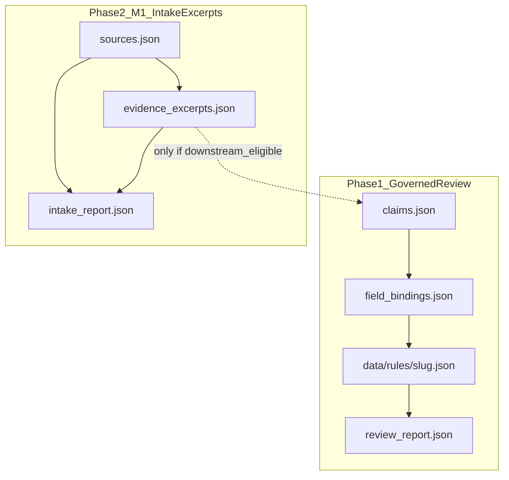

# Governed Country Pipeline — Phase 2 Milestone 1

**Branch:** `claude/governed-country-pipeline-p2-m1`  
**Status:** PLAN APPROVED — Phase 2 Milestone 1 implementation authorized (2026-07-30). Contract edits from governance review are incorporated below.  
**Base:** `main` @ plan merge (`2692761b3` / PR #63), fast-forwarded on this branch before revision  
**Date:** 2026-07-30  
**Review decision addressed:** APPROVE WITH EDITS

---

## 1. Purpose

Close the next slice of executive debt after Phase 1’s **Governed Review Pipeline**.

Phase 2 Milestone 1 builds the **Structured Source Intake → Evidence Excerpts → Validation** loop only.

Governing rule:

> Evidence excerpts preserve what the source says; they do not decide what the project may claim.

This milestone produces auditable evidence objects. It does **not** produce claims, drafts, or publication decisions.

### Offline capability boundary (non-negotiable)

> M1 validator validates declared provenance and structural evidence controls; it does not independently establish textual fidelity unless a locally preserved source capture is available.

Therefore:

| Layer | What it means | What M1 can prove offline |
|---|---|---|
| **Provenance validity** | Declared identity, dates, capture method, pinpoint shape, authority/tier, currency rules | Yes — deterministic artifact validation |
| **Excerpt-to-source fidelity** | That `source_text` actually appears in / faithfully translates the live official page | No — unless a local capture/`content_fingerprint` is present and checked; otherwise human-declared only |

Do not use `verified_at` / `human_verified` wording to imply machine-proven page match.

---

## 2. Explicit non-goals (hard boundaries)

Milestone 1 must **not**:

| Forbidden | Reason |
|---|---|
| Claim extraction | Claims remain Phase 2 Milestone 2+ |
| Claim matrix edits driven by intake automation | Human/controlled matrix revision only |
| Draft / `data/rules/{slug}.json` generation | Phase 1 review consumes drafts; M1 does not create them |
| Field-binding generation | Depends on claims |
| Publication lifecycle changes (`page_status`, `evidence_tier`) | Human-gated |
| Indexing changes (`indexing_allowed`) | Human-gated |
| Automatic PR creation | Out of scope |
| Live network crawling as a CI requirement | CI stays offline/deterministic; fetch may be an optional operator tool later |
| Semantic “what we may assert” inference from excerpts | Violates claim-neutrality |
| Treating offline PASS as proof of textual fidelity to the live URL | Provenance ≠ fidelity |

If an implementation PR touches any of the above, it is out of milestone scope and must be rejected or split.

**Enforcement split (edit #7):**

| Gate | Tool | Responsibility |
|---|---|---|
| Artifact governance | `validate_source_intake.py` | Schema, provenance declarations, neutrality heuristics, currency, downstream eligibility flags |
| PR scope / diff | `validate_pipeline_milestone_scope.py` **or** explicit human PR checklist | Forbid unexpected edits to `claims.json`, `field_bindings.json`, `data/rules/**`, lifecycle fields |

`validate_source_intake.py` must **not** pretend it can see PR diffs. Scope control is a separate gate.

---

## 3. Success criterion (true closed loop for M1)

```text
Official primary source
  → normalized source record
  → bounded evidence excerpts (representation-typed)
  → declared provenance + pinpoint + content-persistence metadata
  → deterministic provenance/structure validation
  → PASS / BLOCK
  → downstream_eligible computed only for settled excerpts
```

M1 PASS means: authored intake artifacts are structurally sound and provenance declarations are complete and consistent.

M1 PASS does **not** mean: every excerpt has been machine-proven against the live official page.

---

## 4. Required per-country outputs

Under the existing pack root (extend Phase 1 layout; do not invent a second country tree):

```text
data/coverage/pipeline/{slug}/
  sources.json              # authored input — normalized official source records
  evidence_excerpts.json    # authored/captured input — excerpts + provenance
  intake_report.json        # GENERATED artifact — never hand-authored PASS
  # Phase 1 artifacts may coexist but are out of M1 mutation scope:
  claims.json               # read-only for M1
  field_bindings.json       # untouched
  review_report.json        # Phase 1 review output; untouched by M1
```

### Artifact roles (edit #4 — fixed contract)

| File | Role | Git / CI rule |
|---|---|---|
| `sources.json` | Authored input | Committed; edited by operators |
| `evidence_excerpts.json` | Authored/captured input | Committed; edited by operators |
| `intake_report.json` | **Generated** artifact | Produced by validator/orchestrator; CI regenerates and fails on **generated-artifact drift** vs committed copy |

Editors must never write `decision: PASS` by hand into `intake_report.json`. The report is an output, like Phase 1 `review_report.json`.

Brazil is the pilot pack. M1 extends source metadata and adds excerpts; default is **no** rewrite of claims/bindings/rules.

---

## 5. Relationship to Phase 1 / Milestone 2



- No automatic wire from excerpts → claims in M1.
- Milestone 2 may consume only excerpts with `downstream_eligible: true` (and pack-level eligibility) as quote/provenance substrate.
- Ambiguous, multi-interpretation, superseded-linked, unreviewed-neutrality, or paraphrase-only excerpts are **not** downstream-eligible until human review closes them.

---

## 6. Artifact contracts

### 6.1 Official source rule (edit #8 — preferred option)

**M1 accepts official primary sources only** for evidence that can become downstream-eligible:

- `tier` = `primary`
- `authority_kind` ∈ official set, e.g.  
  `central_bank` | `customs` | `ministry` | `legislature_publication` | `regulator` | `fiu` | `primary_regulator` | `primary_regulator_faq` | `primary_regulator_rule_page`

Secondary / contextual sources are **out of M1 evidence pack** by default.  
If a discovery note is needed, keep it outside `evidence_excerpts.json` (e.g. operator notes) — do not create secondary excerpts that look claim-ready.

Audit-only superseded primaries may remain in `sources.json` with `currency: superseded` but cannot feed downstream-eligible excerpts.

### 6.2 `sources.json` (normalized source record)

Required fields:

| Field | Purpose |
|---|---|
| `source_id` | Stable ID (`SRC-XX-…`) |
| `label` | Human label |
| `url` | Canonical HTTPS URL (**URL identity**) |
| `type` | `rules_schema` source type |
| `tier` | Must be `primary` for M1 evidence sources |
| `currency` | `current` \| `superseded` \| `unknown` \| `historical` |
| `authority` | Official institution / instrument name |
| `authority_kind` | Official kind enum (see §6.1) |
| `jurisdiction` | ISO2 / country scope |
| `accessed_at` | ISO date of last operator access check |
| `content_persistence` | See §6.3 |

Document / capture identity (edit #3) — require **transparent declaration**; prefer at least one persistence signal:

| Field | Purpose |
|---|---|
| `document_version` | When the issuer declares a version |
| `effective_date` / `published_date` | Document identity dates when known |
| `content_fingerprint` | e.g. `sha256:…` of preserved bytes |
| `retrieved_artifact` | Optional repo-relative path to preserved capture |
| `last_modified_observed` | Optional observed header/value |
| `content_persistence` | `preserved` \| `fingerprinted` \| `not_preserved` |

Rules:

- If no local capture and no fingerprint ⇒ `content_persistence: "not_preserved"` (required honesty).
- `accessed_at` must **not** be marketed as historical reconstructability when `content_persistence` is `not_preserved`.
- `superseded` ⇒ `superseded_by` required and resolvable.

Optional: `language`, `document_title`, `retrieval_method` (`manual` \| `operator_fetch`), `notes` (non-claim).

### 6.3 Content identity vs URL identity (edit #3)

Distinguish explicitly in policy and docs:

1. **URL identity** — the locator (`url`)
2. **Document identity** — version / effective dates / official title
3. **Captured content identity** — fingerprint and/or `retrieved_artifact`

M1 does not require storing full page captures for every source, but must not imply reconstructability without persistence metadata.

### 6.4 `evidence_excerpts.json`

Top-level:

```json
{
  "schema_version": "1.0.0",
  "country_slug": "brazil",
  "excerpts": []
}
```

#### Representation contract (edits #2 and #9)

Mandatory enum:

```text
representation ∈ {
  verbatim_quote,
  faithful_translation,
  bounded_paraphrase
}
```

Separated fields — **do not** mix quotation and paraphrase in one opaque string:

```json
{
  "excerpt_id": "EX-BR-CUST-01",
  "source_id": "SRC-BR-LEI-14286",
  "representation": "verbatim_quote",
  "source_text": "Exact official-language quotation",
  "source_language": "pt",
  "translation_text": null,
  "quote_delimited": true
}
```

| `representation` | Required text fields | Downstream default |
|---|---|---|
| `verbatim_quote` | `source_text` in source language; `quote_delimited: true` | Eligible only if other gates pass |
| `faithful_translation` | `source_text` (original) + `translation_text` + languages | Eligible only if human review closes translation risk **or** policy marks translation review required |
| `bounded_paraphrase` | Paraphrase stored in `translation_text` or dedicated `paraphrase_text` — **never** as if it were `source_text` quotation | **`downstream_eligible: false`** until human review explicitly promotes (default: remains ineligible for claim substrate) |

Normative-looking phrases (“travellers must…”) are allowed in `source_text` **only** when `representation` is `verbatim_quote` (or translation of a verbatim original). There is no free-floating “quoted flag” heuristic — the enum is the contract.

#### Provenance / capture declaration (edit #1)

```json
{
  "capture_status": "human_verified",
  "verified_by": "operator",
  "verified_at": "2026-07-30",
  "verification_method": "manual_source_comparison",
  "captured_at": "2026-07-30",
  "captured_by": "operator",
  "method": "manual_copy",
  "source_accessed_at": "2026-07-30"
}
```

`capture_status` / `verification_method` record **declared human comparison**, not offline cryptographic proof against the live site.

#### Claim-neutrality status (edit #6)

Replace boolean self-assertion `claim_neutral: true` with:

```json
{
  "claim_neutrality_status": "reviewed",
  "operator_interpretation": null
}
```

| `claim_neutrality_status` | Meaning |
|---|---|
| `unreviewed` | Not yet neutrality-reviewed |
| `reviewed` | Operator reviewed; heuristics also clean |
| `exception_required` | Needs human exception before any downstream use |

Neutrality heuristics:

- detect **known** claim-shaped / lifecycle errors
- do **not** prove absence of all semantic inference
- do **not** replace human review

`operator_interpretation` must be `null` for downstream-eligible verbatim quotes. Any operator gloss ⇒ not claim substrate.

#### Pinpoint (unchanged minimum — at least one locator)

```json
{
  "article": "Art. 14 §1-I",
  "section": null,
  "heading": null,
  "page": null,
  "url_fragment": null,
  "locator_note": "…"
}
```

#### Other excerpt fields

| Field | Purpose |
|---|---|
| `excerpt_id` | `EX-XX-…` |
| `source_id` | Must exist in `sources.json` |
| `topics` | Optional tags — not claims |
| `ambiguous` | If true ⇒ human review; not downstream-eligible |
| `allows_superseded` | Only with human-review; never downstream-eligible while superseded binding remains |

### 6.5 Downstream eligibility (edit #5 — non-bypassable)

`intake_report.json` (and optionally mirrored per excerpt) must expose:

```json
{
  "decision": "PASS",
  "downstream_eligible": false,
  "needs_human_review": ["EX-BR-…"]
}
```

Rules:

| Condition | `downstream_eligible` |
|---|---|
| Any open `needs_human_review` item affecting excerpts | Pack-level `false` |
| Excerpt `ambiguous: true` | Excerpt ineligible |
| Excerpt bound to `superseded` source | Excerpt ineligible |
| `representation: bounded_paraphrase` | Excerpt ineligible by default |
| `claim_neutrality_status` ≠ `reviewed` | Excerpt ineligible |
| `content_persistence: not_preserved` | Still may be pack-PASS for provenance structure, but Milestone 2 should treat reconstructability as weak (warn); does not alone block M1 PASS |

**Hard rule:**

> Any excerpt that is ambiguous, multi-interpretation, or linked to a superseded source must not become downstream-eligible for claim extraction until human review is closed.

Decision model:

- Keep binary `decision`: `PASS` | `BLOCK` for structural/provenance gate.
- Use `downstream_eligible` as the separate readiness gate for Milestone 2.
- Do **not** invent a third opaque “PASS meaning ready for claims.”

Optional label in `summary` for humans: `PASS (not downstream-eligible)` when review items remain.

---

## 7. `intake_report.json` (generated only)

Produced by `validate_source_intake.py` / `country_pipeline.py intake-review`:

```json
{
  "schema_version": "1.0.0",
  "country_slug": "brazil",
  "decision": "PASS",
  "downstream_eligible": false,
  "blocking_findings": [],
  "improvement_findings": [],
  "needs_human_review": [],
  "stats": {
    "sources_total": 0,
    "sources_current": 0,
    "sources_superseded": 0,
    "excerpts_total": 0,
    "excerpts_downstream_eligible": 0
  },
  "summary": "INTAKE PASS (not downstream-eligible) | BLOCKED BY N FINDING(S)"
}
```

Layers:

- `structural` — shape/IDs/representation enums
- `provenance` — declared capture/verification fields, pinpoint, persistence honesty
- `authority` — official primary identity
- `currency` — superseded misuse
- `neutrality` — heuristics + neutrality status consistency
- `eligibility` — downstream eligibility computation
- *(no fake “live fidelity” layer that CI cannot prove)*

CI:

1. Run validator; write report to temp or stdout artifact.
2. Compare to committed `intake_report.json`.
3. Fail on drift.

---

## 8. Validator requirements

### 8.1 `scripts/validate_source_intake.py` (artifact gate)

Offline checks:

1. Source identity & official primary authority  
2. URL + currency + superseded_by rules  
3. Declared access/capture/verification fields present and parseable  
4. `content_persistence` declared; fingerprint/artifact consistency when claimed `preserved`/`fingerprinted`  
5. Excerpt ↔ source integrity; representation field rules; no paraphrase-as-quote  
6. Neutrality heuristics + `claim_neutrality_status` consistency  
7. Conflict/ambiguity → `needs_human_review`; force `downstream_eligible: false`  
8. Does **not** require claims/bindings/rules  
9. Does **not** claim live textual fidelity  

### 8.2 `scripts/validate_pipeline_milestone_scope.py` (PR scope gate)

Or equivalent CI step that inspects changed files vs base:

- M1 implementation PR may touch: policy intake block, pipeline schema, intake validators, CI workflow, protocol appendix, `sources.json` / `evidence_excerpts.json` / generated `intake_report.json` for pilot  
- Must **BLOCK** unexpected changes to: `claims.json`, `field_bindings.json`, `data/rules/**` lifecycle fields, publication flips  

If diff tooling is unavailable in a given environment, the PR template must require explicit human attestation — but the preferred path is an automated file-path allowlist check.

### 8.3 Operator commands

```text
python scripts/country_pipeline.py intake-review <slug>
python scripts/validate_source_intake.py
python scripts/validate_pipeline_milestone_scope.py   # on PRs
```

No auto-fix that invents `source_text`.

---

## 9. Policy additions (executable sketch)

```json
{
  "intake": {
    "required_authored_artifacts": ["sources.json", "evidence_excerpts.json"],
    "generated_artifacts": ["intake_report.json"],
    "fail_on_intake_report_drift": true,
    "official_primary_only": true,
    "excerpt_requires_current_source": true,
    "allow_superseded_excerpt_with_human_review": true,
    "superseded_excerpt_never_downstream_eligible": true,
    "ambiguous_never_downstream_eligible": true,
    "bounded_paraphrase_never_downstream_eligible_by_default": true,
    "require_pinpoint": true,
    "require_representation_enum": true,
    "require_content_persistence_declaration": true,
    "require_capture_status": true,
    "claim_neutrality_status_required": true,
    "neutrality_heuristics_are_partial": true,
    "offline_validator_does_not_prove_textual_fidelity": true,
    "stale_source_warn_days": 180,
    "forbidden_operator_voice_patterns": [
      "page_status",
      "indexing_allowed",
      "evidence_tier",
      "verification_target"
    ]
  }
}
```

---

## 10. Brazil pilot expectations (implementation phase only)

1. Extend Brazil `sources.json` with access dates, `authority_kind`, and honest `content_persistence`.  
2. Add `evidence_excerpts.json` using `verbatim_quote` (and translations only when original `source_text` is retained).  
3. Generate `intake_report.json`; commit only the generated form; CI drift-guards it.  
4. Do not mutate claims/bindings/rules in the M1 implementation PR.  
5. Superseded Mercosul/RMCCI: audit only; no downstream-eligible excerpts.

---

## 11. Implementation order (after final APPROVE)

1. Update branch from current `main` (done for this revision; repeat immediately before coding if `main` moves again)  
2. Policy `intake` block + schema constants  
3. `validate_source_intake.py` + generated report + drift check  
4. `validate_pipeline_milestone_scope.py` (or CI path allowlist)  
5. Brazil pilot authored artifacts + generated report  
6. Protocol Appendix B  
7. Stop. Open implementation PR for Milestone 1 only.

---

## 12. Merge recommendation criteria (future implementation PR)

PASS only if:

- Diff limited to M1 allowlisted paths  
- No claim extraction / draft generation / lifecycle or indexing flips  
- Brazil intake `decision` is PASS or BLOCK with explicit blocking findings (no hand-written PASS)  
- `downstream_eligible` is false whenever `needs_human_review` is non-empty or unsettled excerpt classes remain  
- Phase 1 staging review still PASS  
- Governance Gate green  
- Plan’s three non-bypassable corrections are implemented in code/policy:
  1. Provenance validation ≠ textual fidelity  
  2. Verbatim / translation / paraphrase separation  
  3. Unsettled excerpts never downstream-eligible  

---

## 13. Reviewer decision on this revised plan

Prior decision: **APPROVE WITH EDITS** — edits incorporated in this document.

Please return one of:

1. **APPROVE M1 PLAN** — proceed to implementation on this branch  
2. **APPROVE WITH EDITS** — further contract changes required  
3. **BLOCK** — cite remaining defect  

This revision is **plan only**. No executable M1 behavior is introduced in this commit.
