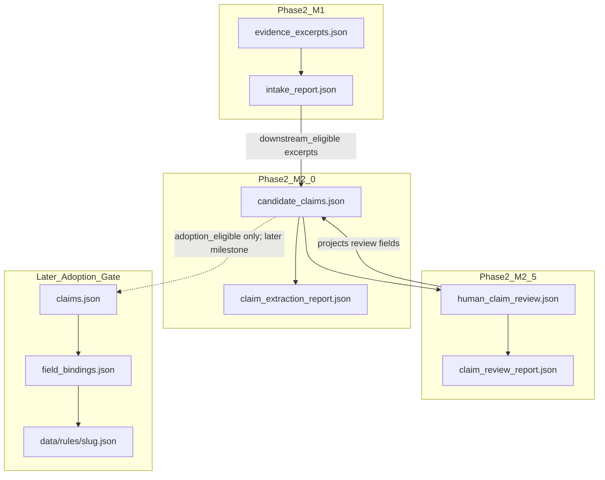

# Governed Country Pipeline — Phase 2 Milestone 2.5

**Title:** Governed Human Claim Review / Adoption Gate  
**Branch:** `claude/governed-country-pipeline-p2-m2.5`  
**Status:** PLAN DRAFT — awaiting **APPROVE M2.5 PLAN** before implementation  
**Base:** `main` @ Phase 2 M2.0 merge (`fd2bfaa57` / PR #67)  
**Date:** 2026-07-30  
**Depends on:** Phase 1 + Phase 2 M1 + Phase 2 M2.0 (candidates only)  
**Does not open:** M2.1 composition/synthesis · claims adoption · field bindings · rules · publication

---

## 1. Purpose

Close the intentional gap left by M2.0:

```text
atomic candidate claim
  → structural validation
  → pending human semantic review   ← M2.0 stops here
```

M2.5 performs **governed human claim review** and classifies candidates. It does **not** adopt them into the project claim matrix.

Governing rule:

> M2.5 may close semantic review and classify candidate claims, but it may not adopt them into `claims.json`.

Opening posture:

> Reviewed candidates may become **adoption-eligible**. They do not become **adopted project claims** in this milestone.

Non-bypassable separation:

```text
downstream_eligible  ≠  adopted
adoption_eligible    ≠  adopted
```

A candidate may be closed, classified, and marked adoption-eligible for a **later** Adoption Gate. M2.5 never writes project claims.

---

## 2. Explicit non-goals (hard boundaries)

| Forbidden | Reason |
|---|---|
| Writing into `claims.json` | Later Adoption Gate only |
| Writing into `field_bindings.json` | Depends on adopted claims |
| `data/rules/**` changes | Draft / publication stage |
| Draft generation | Out of scope |
| Publication / indexing / lifecycle flips | Human-gated later |
| Multi-source synthesis / single-source composition | Still M2.1+; not opened by review |
| Automatic semantic approval | Human-only meaning judgment |
| Auto-setting `supported` / `bounded` / `rejected` | Human-only classification |
| Auto-setting `adoption_eligible: true` | Human close + fingerprint only |
| Inventing new candidate claims as a side effect of review | Extraction remains M2.0 |
| Expanding evidence links or transformation modes during review | Would reopen extraction contract |
| Treating `downstream_eligible` or `adoption_eligible` as adoption | Naming trap — forbidden |
| Closing review without fingerprint match | Invalid / stale approval |
| Silent rewrite of `candidate_text` | Audit base must remain; use `reviewed_text` |

If an implementation PR touches any forbidden item, reject or split.

---

## 3. Success criterion (M2.5 closed loop)

```text
candidate_claims.json (M2.0 structural candidates)
  → human semantic review record
  → optional reviewed_text (narrowing only)
  → fingerprint closure
  → decision: supported | bounded | rejected
  → candidate fields updated to match closed review
  → adoption_eligible only if accepted + fingerprint fresh
  → claim_review_report.json structural PASS
  → STOP (no claims.json)
```

**PASS means:** review artifacts are complete, consistent with candidates, fingerprints match closed reviews, and no forbidden adoption writes occurred.

**PASS does not mean:** candidates are project claims, drafts, or publishable country rules.

Report must include:

```json
"adoption_status": "not_adopted",
"semantic_approval": "human_review_only"
```

`semantic_approval: human_review_only` means classification came from closed human review records — not from machine auto-approval, and not from project-claim adoption.

---

## 4. Artifacts

```text
data/coverage/pipeline/{slug}/
  sources.json                    # read-only
  evidence_excerpts.json          # read-only
  intake_report.json              # read-only (eligibility cross-check)
  candidate_claims.json           # MUTATE review fields only
  claim_extraction_report.json    # read-only / regenerate only if candidates structural fields unchanged
  human_claim_review.json         # NEW — authored human review ledger
  claim_review_report.json        # NEW — generated only
  # untouched:
  claims.json
  field_bindings.json
  review_report.json              # Phase 1
```

| File | Role |
|---|---|
| `human_claim_review.json` | Authored human review ledger (source of truth for close decisions) |
| `claim_review_report.json` | **Generated** — never hand-authored PASS |
| `candidate_claims.json` | Projection target for review outcomes; not a project claim store |
| `claims.json` | Phase 1 matrix — **forbidden write** in M2.5 |

### Allowed mutations to `candidate_claims.json`

Only these fields may change in M2.5:

- `reviewed_text`
- `semantic_review_status`
- `special_review_required` (human may clear only after special issues addressed; may not invent new composition)
- `support_status`
- `downstream_eligible`
- `adoption_eligible` *(new field; default `false`)*
- `authority_posture.authority_preservation_status`
- `exception_handling.exception_review_status` / `exception_preserved` / notes-linked fields
- `human_review.*`

Forbidden candidate mutations in M2.5:

- `candidate_id`, `candidate_text`, `claim_language`, `claim_type`
- `scope` (any change invalidates prior fingerprint; requires explicit reopen + new review — prefer reject/re-extract over silent scope edit)
- `evidence_links`, `transformation`, `origin`
- Adding/removing candidates (except documenting `rejected` / `superseded` status on existing IDs)

If wording must change, set `reviewed_text`; do not overwrite `candidate_text`.

---

## 5. Relationship to prior / later phases



M2.1 synthesis remains **closed**. M2.5 reviews atomic M2.0 candidates only.

---

## 6. Field separation (non-negotiable)

| Field | Owner | Meaning |
|---|---|---|
| `candidate_text` | M2.0 authoring/extraction | Immutable audit wording |
| `reviewed_text` | Human reviewer | Null, or narrowed/approved wording on `bounded` / accepted close |
| `human_review.decision` / review ledger `decision` | Human | `supported` \| `bounded` \| `rejected` |
| `reviewed_candidate_fingerprint` | Machine compute + human bind | Hash of review-subject payload at close time |
| `downstream_eligible` | Human promotion after M2 gates | May feed later pipeline stages; **not adopted** |
| `adoption_eligible` | Human promotion after M2.5 gates | May enter a **future** Adoption Gate; **not adopted** |
| `adopted` / presence in `claims.json` | Future Adoption Gate only | Out of M2.5 |

### Rule of rules

> `downstream_eligible ≠ adopted`  
> `adoption_eligible ≠ adopted`  
> M2.5 never sets an `adopted: true` flag and never inserts claim IDs into `claims.json`.

---

## 7. `human_claim_review.json` contract

```json
{
  "schema_version": "1.0.0",
  "country_slug": "brazil",
  "milestone": "m2.5",
  "notes": "Governed human reviews for M2.0 candidates. Classification only — not adoption.",
  "reviews": [
    {
      "review_id": "HCR-BR-001",
      "candidate_id": "CC-BR-FX-001",
      "reviewer": "operator-id",
      "reviewed_at": "2026-07-30",
      "status": "closed",
      "decision": "supported",
      "candidate_text_snapshot": "…must equal candidate.candidate_text…",
      "reviewed_text": null,
      "reviewed_candidate_fingerprint": "sha256:…",
      "semantic_review_status": "closed",
      "authority_preservation_status": "human_confirmed",
      "exception_review_status": "closed",
      "exception_preserved": true,
      "special_review_addressed": true,
      "downstream_eligible": true,
      "adoption_eligible": true,
      "rationale": "Same-language restatement contained in EX-BR-…; exceptions observed.",
      "findings": [],
      "invalidates_prior_review": false
    }
  ]
}
```

### Review item required keys

`review_id` · `candidate_id` · `reviewer` · `reviewed_at` · `status` · `decision` · `candidate_text_snapshot` · `reviewed_text` · `reviewed_candidate_fingerprint` · `semantic_review_status` · `authority_preservation_status` · `exception_review_status` · `downstream_eligible` · `adoption_eligible` · `rationale`

### Status / decision enums

| Field | Values |
|---|---|
| `status` | `pending` \| `closed` |
| `decision` | `supported` \| `bounded` \| `rejected` \| `deferred` (pending only) |
| `semantic_review_status` | must be `closed` when `status == closed` |
| `authority_preservation_status` | `unreviewed` \| `structurally_consistent` \| `human_confirmed` \| `mismatch` |
| `exception_review_status` | `pending` \| `closed` |

`deferred` may appear only while `status == pending`. Closed reviews must use `supported` | `bounded` | `rejected`.

---

## 8. Projection onto `candidate_claims.json`

When a review is `closed`, the matching candidate **must** reflect:

```json
{
  "reviewed_text": "<from review or null>",
  "semantic_review_status": "closed",
  "support_status": "supported|bounded|rejected",
  "downstream_eligible": true|false,
  "adoption_eligible": true|false,
  "authority_posture": {
    "authority_preservation_status": "human_confirmed|mismatch|…"
  },
  "exception_handling": {
    "exception_review_status": "closed",
    "exception_preserved": true|false|null
  },
  "human_review": {
    "status": "closed",
    "reviewed_by": "<reviewer>",
    "reviewed_at": "<date>",
    "decision": "supported|bounded|rejected",
    "reviewed_candidate_fingerprint": "sha256:…",
    "notes": "<rationale summary or null>"
  }
}
```

Ledger ↔ candidate mismatch → BLOCK.

One closed review per `candidate_id` is authoritative. Superseding a prior closed review requires a new review row with `invalidates_prior_review: true` and fresh fingerprint; prior close becomes historical only if schema keeps history — M2.5 default: **one active closed review per candidate**.

---

## 9. Fingerprint contract (reuse + extend)

Fingerprint payload (stable canonical JSON) must cover at least:

- `candidate_text`
- `reviewed_text`
- `scope`
- `evidence_links`
- `transformation`
- `claim_type` / `claim_language`
- `authority_posture.source_authority_level` + `claim_voice`
- material `exception_handling` fields

On close:

1. Machine computes fingerprint of current candidate (+ reviewed_text from review).
2. Human record stores that fingerprint.
3. Candidate `human_review.reviewed_candidate_fingerprint` must equal it.
4. Validator recomputes and BLOCKS drift.

### Invalidation rule

> Any later change to `candidate_text`, `reviewed_text`, `scope`, `evidence_links`, or `transformation` invalidates the closed review and forces:
>
> - `human_review.status → pending`
> - `support_status → unreviewed`
> - `downstream_eligible → false`
> - `adoption_eligible → false`
> - `semantic_review_status → pending`

M2.5 validator must detect stale fingerprints even if humans forget to reopen.

---

## 10. Promotion gates

### 10.1 `downstream_eligible: true` (unchanged M2 intent; human-set in M2.5)

Requires **all**:

1. Closed human review + fingerprint match  
2. `semantic_review_status == closed`  
3. `support_status ∈ {supported, bounded}`  
4. Exception review closed when required by policy  
5. Linked M1 excerpts remain downstream-eligible  
6. No banned transformation mode  
7. Authority status not `mismatch`

Machine never auto-promotes.

### 10.2 `adoption_eligible: true` (M2.5-specific)

Requires **all** of §10.1, plus:

1. Explicit human mark `adoption_eligible: true` in the review ledger  
2. `authority_preservation_status == human_confirmed`  
3. `decision ∈ {supported, bounded}` (`rejected` can never be adoption-eligible)  
4. If `special_review_required` was true, review must record `special_review_addressed: true`  
5. `reviewed_text` present when `decision == bounded`; null allowed when `decision == supported` and wording accepted as `candidate_text`

### 10.3 Rejected candidates

```json
{
  "decision": "rejected",
  "support_status": "rejected",
  "downstream_eligible": false,
  "adoption_eligible": false,
  "semantic_review_status": "closed"
}
```

Rejection is a closed human outcome, not adoption.

---

## 11. Machine vs human guarantees

### Machine can prove

- Review ledger schema / required keys  
- One active closed review per candidate (or explicit supersession rules)  
- `candidate_text_snapshot` equals current `candidate_text`  
- Fingerprint freshness  
- Projection consistency (ledger → candidate fields)  
- Promotion gate boolean logic  
- Absence of `claims.json` / bindings / rules writes (scope gate)  
- Report drift  
- No auto semantic approval artifacts (`semantic_approval` ≠ machine-approved)

### Machine cannot alone prove

- Legal meaning preservation  
- That omissions are immaterial  
- That `bounded` narrowing is the correct legal scope  
- That authority voice is correct in context  
- That a candidate should become a project claim later  

---

## 12. Validators

### `validate_human_claim_review.py` (new)

Validates `human_claim_review.json` + projection onto `candidate_claims.json` + fingerprint/promotion gates.  
Writes/checks `claim_review_report.json` with `--write-report` / `--check-drift`.

Also re-runs / depends on M2 structural constraints remaining true (no new composition, one direct excerpt, language↔mode).

### Extend `validate_pipeline_milestone_scope.py`

When M2.5 paths change, forbid:

- `data/coverage/pipeline/*/claims.json`
- `data/coverage/pipeline/*/field_bindings.json`
- `data/rules/**`
- publication/indexing metadata edits

Allow:

- `human_claim_review.json`
- `claim_review_report.json`
- review-field updates to `candidate_claims.json`
- policy/schema/validators/protocol/docs for M2.5

### Regression

```text
python scripts/validate_source_intake.py --check-drift
python scripts/validate_claim_extraction.py --check-drift
python scripts/validate_human_claim_review.py --check-drift
python scripts/validate_country_pipeline.py brazil
python scripts/validate_pipeline_milestone_scope.py --base origin/main
```

### Orchestrator

```text
python scripts/country_pipeline.py claim-review <slug>
```

Writes `claim_review_report.json`. Does not touch `claims.json`.

---

## 13. Generated report

```json
{
  "schema_version": "1.0.0",
  "country_slug": "brazil",
  "decision": "PASS",
  "adoption_status": "not_adopted",
  "semantic_approval": "human_review_only",
  "blocking_findings": [],
  "improvement_findings": [],
  "needs_human_review": [],
  "stats": {
    "candidates_total": 5,
    "reviews_closed": 0,
    "supported": 0,
    "bounded": 0,
    "rejected": 0,
    "downstream_eligible": 0,
    "adoption_eligible": 0,
    "claims_adopted": 0
  },
  "summary": "CLAIM REVIEW PASS (classification only; not adopted)",
  "capability_note": "M2.5 validates human review closure and adoption-eligibility gates. It does not write claims.json and does not prove publishability."
}
```

`stats.claims_adopted` must always be `0` in M2.5. Non-zero → BLOCK.

---

## 14. Auto-correction

One cycle; non-semantic only (IDs, ordering, stats, report regen, whitespace).

Never auto-edit:

- decisions, rationales, fingerprints  
- `support_status`, eligibility flags  
- `reviewed_text` / `candidate_text`  
- authority or exception human outcomes  

---

## 15. Brazil pilot (implementation phase)

Operate on the existing **5** M2.0 Brazil candidates:

| ID | Expected review posture (illustrative; human decides) |
|---|---|
| `CC-BR-FX-001` | Semantic + exception close (signal present) |
| `CC-BR-FX-002` | Semantic close |
| `CC-BR-FX-003` | Semantic + exception-type close |
| `CC-BR-CUST-001` | Semantic + declared omission review |
| `CC-BR-CUST-002` | Special review required + bounded likely |

Pilot rules:

- Human may `support`, `bound`, or `reject` any subset  
- Prefer leaving at least one path that demonstrates `adoption_eligible: true` **and** one that remains not adoption-eligible / rejected — without requiring all five to be accepted  
- **Zero** writes to `claims.json` / `field_bindings.json` / `data/rules/brazil.json`  
- No English rewrites labeled as `direct_restating`  
- No composition

First implementation PR may land validator + empty/pending ledger + report PASS with all reviews still pending **or** include closed reviews for a subset — either is acceptable if gates hold. Prefer closing a real human subset in the same PR only when an operator actually performed the review.

---

## 16. Policy sketch

```json
{
  "human_claim_review": {
    "milestone": "m2.5",
    "forbids_claims_adoption": true,
    "forbids_field_bindings": true,
    "forbids_rules_writes": true,
    "forbids_publication_indexing": true,
    "forbids_multi_source_synthesis": true,
    "forbids_automatic_semantic_approval": true,
    "requires_fingerprint_on_close": true,
    "requires_candidate_text_immutability": true,
    "bounded_requires_reviewed_text": true,
    "supported_may_keep_reviewed_text_null": true,
    "adoption_eligible_requires_human_confirmed_authority": true,
    "adoption_eligible_requires_accepted_decision": true,
    "downstream_eligible_does_not_mean_adopted": true,
    "adoption_eligible_does_not_mean_adopted": true,
    "stats_claims_adopted_must_be_zero": true,
    "fail_on_report_drift": true,
    "max_auto_correct_cycles": 1,
    "required_authored_artifacts": ["human_claim_review.json"],
    "generated_artifacts": ["claim_review_report.json"],
    "allowed_candidate_mutation_fields": [
      "reviewed_text",
      "semantic_review_status",
      "special_review_required",
      "support_status",
      "downstream_eligible",
      "adoption_eligible",
      "authority_posture.authority_preservation_status",
      "exception_handling.exception_review_status",
      "exception_handling.exception_preserved",
      "human_review"
    ]
  }
}
```

Extend `candidate_claims` items with:

```json
"adoption_eligible": false
```

Default `false` for all existing Brazil candidates until human close.

---

## 17. Protocol

Add **Appendix D — Phase 2 Milestone 2.5 (Governed Human Claim Review / Adoption Gate)** to `COUNTRY_REVIEW_EXECUTION_PROTOCOL.md`.

Must state:

- review ≠ adoption  
- `downstream_eligible ≠ adopted`  
- `adoption_eligible ≠ adopted`  
- operator command for `claim-review`  
- hard write bans

---

## 18. Implementation order (after APPROVE M2.5 PLAN)

1. Sync from current `main` (post–M2.0)  
2. Executable `human_claim_review` policy + schema (`adoption_eligible`, review enums)  
3. `validate_human_claim_review.py` + report + drift  
4. Extend scope gate + CI  
5. Add `adoption_eligible: false` to Brazil candidates  
6. Author Brazil `human_claim_review.json` (pending and/or closed human subset)  
7. Protocol Appendix D  
8. Run M1 + M2 + M2.5 + Phase 1 gates  
9. Open implementation PR  
10. **Stop** — no `claims.json` adoption

---

## 19. Implementation PR acceptance

- M2.5 validator PASS · report drift PASS  
- M2 extraction drift PASS · M1 PASS · Phase 1 staging PASS · scope PASS · Governance Gate PASS  
- Diff contains **no** `claims.json`, `field_bindings.json`, or `data/rules/**` writes  
- `stats.claims_adopted == 0`  
- PR body states: **reviewed / adoption-eligible candidates are not published claims**

---

## 20. Phase separation (locked)

| Milestone | May do | Must not do |
|---|---|---|
| M2.0 | Extract atomic candidates | Close meaning / adopt |
| **M2.5** | Human classify + fingerprint + adoption-eligible | Write `claims.json` / synthesize |
| Later Adoption Gate | Copy accepted candidates into `claims.json` | Skip human review |
| M2.1 | Composition (if ever approved) | Bypass M2.5 review |

---

## 21. Reviewer decision on this plan

This document is **plan only**. No executable M2.5 behavior is introduced in this commit.

Please return one of:

1. **APPROVE M2.5 PLAN** — proceed to bounded implementation  
2. **APPROVE WITH EDITS** — cite required contract changes  
3. **BLOCK** — cite remaining defect  

---

## 22. One-line charter

> M2.5 closes human semantic review on M2.0 candidates and may mark them adoption-eligible; it never adopts them into `claims.json`.
