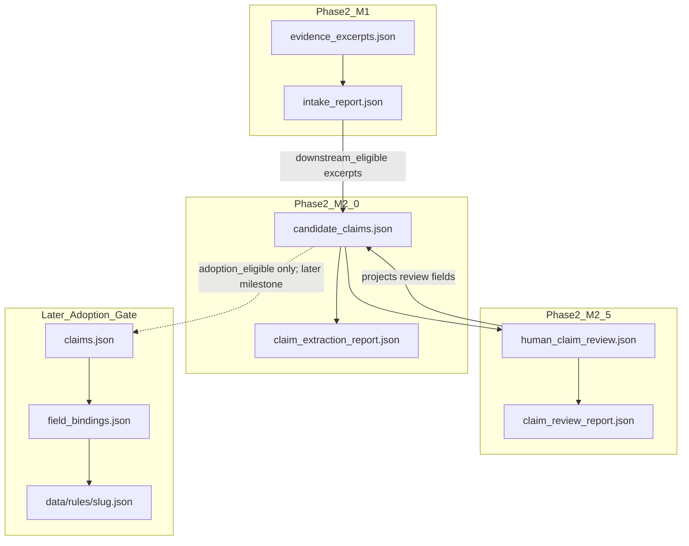

# Governed Country Pipeline — Phase 2 Milestone 2.5

**Title:** Governed Human Candidate Claim Review  
**Branch:** `claude/m2.5-ratification-gate`  
**Status:** PLAN REVISED — ratification contract edits incorporated; awaiting **APPROVE M2.5 PLAN** before implementation  
**Current governed baseline:** `main` @ `682f2e368` / PR #70  
**Original plan base (historical):** `main` @ Phase 2 M2.0 merge (`fd2bfaa57` / PR #67)  
**Date:** 2026-08-15  
**Depends on:** Phase 1 + Phase 2 M1 + Phase 2 M2.0 (candidates only)  
**Does not open:** M2.1 composition/synthesis · claims adoption · field bindings · rules · publication · M3-2  
**M3 freeze:** M3-0/M3-1 are frozen governed baseline. M2.5 implementation MUST NOT modify M3 surfaces. M3-2 remains paused.  
**Review decision addressed:** APPROVE WITH EDITS — ratification not yet complete until this patch is reviewed

---

## 1. Purpose

Close the intentional gap left by M2.0:

```text
atomic candidate claim
  → structural validation
  → pending human semantic review   ← M2.0 stops here
```

M2.5 performs **governed human claim review** of the Brazil pilot candidates and classifies each one. It does **not** adopt them into the project claim matrix.

Governing rule:

> M2.5 may close semantic review and classify candidate claims, but it may not adopt them into `claims.json`.

Opening posture:

> Reviewed candidates may become **adoption-eligible**. They do not become **adopted project claims** in this milestone.

Non-bypassable separation:

```text
downstream_eligible              ≠  adopted
adoption_gate_conditions_met     ≠  adoption_eligible
adoption_eligible                ≠  adopted
infrastructure PASS              ≠  milestone PASS
```

A candidate may be closed, classified, and marked adoption-eligible for a **later** Adoption Gate. M2.5 never writes project claims.

### 1.1 Vocabulary Boundary (non-bypassable)

M2.5 candidate-review vocabulary is local to `candidate_claims.json` / `human_claim_review.json` and MUST NOT be interpreted as project-claim status.

```text
supported        ≠ verified
needs_evidence   ≠ verification_target
```

M2.5 `decision=bounded` means:

> the candidate wording is acceptable only in a narrowed reviewed form.

It does **not** automatically map to the project-claim workflow status `bounded`.

No M2.5 decision is projected into `claims.json`.  
Any mapping between candidate-review decisions and project-claim statuses belongs exclusively to the later Adoption Gate.

| M2.5 candidate decision | Must not be read as |
|---|---|
| `supported` | Phase 1 / CRES `verified` |
| `bounded` | Phase 1 / CRES workflow status `bounded` |
| `needs_evidence` | CRES / Phase 1 `verification_target` |
| `rejected` | a project-claim row of any status |

---

## 2. Explicit non-goals (hard boundaries)

| Forbidden | Reason |
|---|---|
| Writing into `claims.json` | Later Adoption Gate only |
| Writing into `field_bindings.json` | Depends on adopted claims |
| `data/rules/**` changes | Draft / publication stage |
| Draft generation | Out of scope |
| Publication / indexing / lifecycle flips | Human-gated later |
| Multi-source synthesis / single-source composition | Still M2.1+; not opened by review |
| Automatic semantic approval | Human-only meaning judgment |
| Auto-setting `supported` / `bounded` / `rejected` / `needs_evidence` | Human-only classification |
| Auto-setting `adoption_eligible: true` | Explicit human intent only |
| Declaring `milestone_decision: PASS` with incomplete review coverage | Completion semantics edit #1–#2 |
| Inventing new candidate claims as a side effect of review | Extraction remains M2.0 |
| Expanding evidence links or transformation modes during review | Would reopen extraction contract |
| Treating `downstream_eligible` or `adoption_eligible` as adoption | Naming trap — forbidden |
| Closing review without fingerprint match | Invalid / stale approval |
| Silent rewrite of `candidate_text` | Audit base must remain; use `reviewed_text` |
| Open-ended `deferred` for Brazil pilot candidates | Edit #5 — every in-scope candidate needs a closed outcome |
| Interpreting M2.5 decisions as project-claim statuses | Vocabulary Boundary — mapping is later Adoption Gate only |
| Machine-mutating review fields on fingerprint drift | Validator BLOCKS; human reopens |
| M3 surfaces (`dataset.html`, sample package, Zenodo/HF, M3 plan/impl) | M3-0/M3-1 frozen; M3-2 paused |

If an implementation PR touches any forbidden item, reject or split.

---

## 3. Dual success criteria (Infrastructure ≠ Completion)

M2.5 has **two gates**. They must not be collapsed into one PASS.

### 3.1 Infrastructure Gate

```text
policy + schema + validator + drift + scope + regressions
  → infrastructure_decision: PASS | BLOCK
```

May succeed while human reviews are still pending.

### 3.2 Brazil Review Completion Gate

```text
review_scope (5 Brazil candidates)
  → one review row each
  → all five closed with fingerprint
  → projection consistent
  → valid decisions
  → 0 forbidden writes
  → review_completion: COMPLETE | PENDING | BLOCK
```

### 3.3 Milestone decision

```text
milestone_decision: PASS
  only if infrastructure_decision == PASS
  AND review_completion == COMPLETE
```

Otherwise:

| Condition | `infrastructure_decision` | `review_completion` | `milestone_decision` |
|---|---|---|---|
| Infra broken | `BLOCK` | n/a or `BLOCK` | `BLOCK` |
| Infra ok, missing review row | `PASS` | `BLOCK` | `BLOCK` |
| Infra ok, some pending | `PASS` | `PENDING` | `PENDING` |
| Infra ok, 5/5 closed | `PASS` | `COMPLETE` | `PASS` |

**Governing-state rule:**

> Do **not** record Phase 2 M2.5 as a completed governing state until **both** gates succeed (`milestone_decision: PASS`).

Infrastructure-only success is an implementation checkpoint, not milestone completion.

---

## 4. Review scope (Brazil pilot — edit #2)

`human_claim_review.json` must declare:

```json
"review_scope": {
  "candidate_ids": [
    "CC-BR-FX-001",
    "CC-BR-FX-002",
    "CC-BR-FX-003",
    "CC-BR-CUST-001",
    "CC-BR-CUST-002"
  ],
  "required_reviews": 5
}
```

Coverage rules:

| Condition | Effect |
|---|---|
| Missing review row for any scoped ID | `review_completion: BLOCK` (and milestone cannot PASS) |
| Review present but `status == pending` | `review_completion: PENDING` |
| All five `status == closed` + fingerprints fresh + projections consistent | `review_completion: COMPLETE` (completion-eligible) |

Humans are **not** forced to accept candidates. Any scoped candidate may be `supported`, `bounded`, `rejected`, or `needs_evidence` — but **all five must be reviewed and closed**.

Report must expose:

```json
"review_coverage": {
  "required": 5,
  "recorded": 5,
  "closed": 5,
  "missing_candidate_ids": []
}
```

---

## 5. Artifacts

```text
data/coverage/pipeline/{slug}/
  sources.json                    # read-only
  evidence_excerpts.json          # read-only
  intake_report.json              # read-only (eligibility cross-check)
  candidate_claims.json           # MUTATE review fields only
  claim_extraction_report.json    # read-only unless structural regen required
  human_claim_review.json         # NEW — authored human review ledger
  claim_review_report.json        # NEW — generated only
  # untouched:
  claims.json
  field_bindings.json
  review_report.json              # Phase 1
```

| File | Role |
|---|---|
| `human_claim_review.json` | Authored human review ledger (**source of truth** for close decisions) |
| `claim_review_report.json` | **Generated** — never hand-authored PASS |
| `candidate_claims.json` | Projection target for review outcomes; not a project claim store |
| `claims.json` | Phase 1 matrix — **forbidden write** in M2.5 |

### Allowed mutations to `candidate_claims.json`

Only these fields may change in M2.5:

- `reviewed_text`
- `semantic_review_status`
- `special_review_required` (human may clear only after special issues addressed)
- `support_status`
- `downstream_eligible`
- `adoption_eligible`
- `adoption_gate_conditions_met` *(machine-computed projection; humans do not invent it)*
- `authority_posture.authority_preservation_status`
- `exception_handling.exception_review_status` / `exception_preserved`
- `human_review.*`

Forbidden candidate mutations in M2.5:

- `candidate_id`, `candidate_text`, `claim_language`, `claim_type`
- `scope` (prefer reject / re-extract over silent scope edit)
- `evidence_links`, `transformation`, `origin`
- Adding/removing candidates outside the fixed review scope

If wording must change, set `reviewed_text`; do not overwrite `candidate_text`.

---

## 6. Relationship to prior / later phases



M2.1 synthesis remains **closed**. M2.5 reviews atomic M2.0 Brazil pilot candidates only.

---

## 7. Field separation (non-negotiable)

| Field | Owner | Meaning |
|---|---|---|
| `candidate_text` | M2.0 authoring/extraction | Immutable audit wording |
| `reviewed_text` | Human reviewer | Null, or narrowed/approved wording on `bounded` / accepted close |
| Review ledger `decision` | Human | `supported` \| `bounded` \| `rejected` \| `needs_evidence` |
| `reviewed_candidate_fingerprint` | Machine compute + human bind | Hash of review-subject payload at close time |
| `downstream_eligible` | Human promotion after gates | May feed later pipeline stages; **not adopted** |
| `adoption_gate_conditions_met` | **Machine-computed** | Objective gate checklist result |
| `adoption_eligible` | **Explicit human mark** | Human nominates for later Adoption Gate |
| Presence in `claims.json` | Future Adoption Gate only | Out of M2.5 |

### Rule of rules

> `downstream_eligible ≠ adopted`  
> `adoption_gate_conditions_met ≠ adoption_eligible`  
> `adoption_eligible ≠ adopted`  
> M2.5 never sets an `adopted: true` flag and never inserts claim IDs into `claims.json`.

---

## 8. `human_claim_review.json` contract

```json
{
  "schema_version": "1.0.0",
  "country_slug": "brazil",
  "milestone": "m2.5",
  "notes": "Governed human reviews for M2.0 Brazil pilot candidates. Classification only — not adoption.",
  "review_scope": {
    "candidate_ids": [
      "CC-BR-FX-001",
      "CC-BR-FX-002",
      "CC-BR-FX-003",
      "CC-BR-CUST-001",
      "CC-BR-CUST-002"
    ],
    "required_reviews": 5
  },
  "reviews": [
    {
      "review_id": "HCR-BR-001",
      "candidate_id": "CC-BR-FX-001",
      "reviewer": "operator-id",
      "reviewed_at": "2026-07-30",
      "status": "closed",
      "decision": "supported",
      "candidate_text_snapshot": "…must equal candidate.candidate_text…",
      "reviewed_text": null,
      "reviewed_candidate_fingerprint": "sha256:…",
      "semantic_review_status": "closed",
      "authority_preservation_status": "human_confirmed",
      "exception_review_status": "closed",
      "exception_preserved": true,
      "special_review_addressed": true,
      "downstream_eligible": true,
      "adoption_gate_conditions_met": true,
      "adoption_eligible": true,
      "rationale": "Same-language restatement contained in EX-BR-…; exceptions observed.",
      "findings": [],
      "invalidates_prior_review": false
    }
  ]
}
```

### Review item required keys

`review_id` · `candidate_id` · `reviewer` · `reviewed_at` · `status` · `decision` · `candidate_text_snapshot` · `reviewed_text` · `reviewed_candidate_fingerprint` · `semantic_review_status` · `authority_preservation_status` · `exception_review_status` · `downstream_eligible` · `adoption_gate_conditions_met` · `adoption_eligible` · `rationale`

### Status / decision enums (edit #5)

| Field | Values |
|---|---|
| `status` | `pending` \| `closed` |
| `decision` (when closed) | `supported` \| `bounded` \| `rejected` \| `needs_evidence` |
| `semantic_review_status` | must be `closed` when `status == closed` |
| `authority_preservation_status` | `unreviewed` \| `structurally_consistent` \| `human_confirmed` \| `mismatch` |
| `exception_review_status` | `pending` \| `closed` |

**Brazil pilot:** open-ended `deferred` is **banned**. Evidence is already M1-downstream-eligible; each scoped candidate entered review to receive a closed outcome.

`needs_evidence` is a **closed** human result meaning: review was performed and the candidate is not accepted because evidence is insufficient for support/bound. It is not a forever-pending state.

```json
{
  "status": "closed",
  "decision": "needs_evidence",
  "support_status": "needs_evidence",
  "downstream_eligible": false,
  "adoption_gate_conditions_met": false,
  "adoption_eligible": false,
  "semantic_review_status": "closed"
}
```

---

## 9. Projection onto `candidate_claims.json`

When a review is `closed`, the matching candidate **must** reflect:

```json
{
  "reviewed_text": "<from review or null>",
  "semantic_review_status": "closed",
  "support_status": "supported|bounded|rejected|needs_evidence",
  "downstream_eligible": true|false,
  "adoption_gate_conditions_met": true|false,
  "adoption_eligible": true|false,
  "authority_posture": {
    "authority_preservation_status": "human_confirmed|mismatch|…"
  },
  "exception_handling": {
    "exception_review_status": "closed",
    "exception_preserved": true|false|null
  },
  "human_review": {
    "status": "closed",
    "reviewed_by": "<reviewer>",
    "reviewed_at": "<date>",
    "decision": "supported|bounded|rejected|needs_evidence",
    "reviewed_candidate_fingerprint": "sha256:…",
    "notes": "<rationale summary or null>"
  }
}
```

Ledger ↔ candidate mismatch → BLOCK.

One closed review per `candidate_id` is authoritative. Superseding a prior closed review requires a new review row with `invalidates_prior_review: true` and fresh fingerprint. M2.5 default: **one active closed review per scoped candidate**.

---

## 10. Fingerprint contract (reuse + extend)

Fingerprint payload (stable canonical JSON) must cover at least:

- `candidate_text`
- `reviewed_text`
- `scope`
- `evidence_links`
- `transformation`
- `claim_type` / `claim_language`
- `authority_posture.source_authority_level` + `claim_voice`
- material `exception_handling` fields

On close:

1. Machine computes fingerprint of current candidate (+ reviewed_text from review).
2. Human record stores that fingerprint.
3. Candidate `human_review.reviewed_candidate_fingerprint` must equal it.
4. Validator recomputes and BLOCKS drift.

### Invalidation rule

> Any later change to `candidate_text`, `reviewed_text`, `scope`, `evidence_links`, or `transformation` makes a previously closed review **stale**.

```text
fingerprint drift
  → validator BLOCKS
```

The validator MUST NOT mutate `candidate_claims.json` or `human_claim_review.json`.

A human must explicitly reopen the stale review, apply the required pending / unreviewed / false state, and later close it again with a fresh fingerprint.

Required resulting state **after human reopen** (not machine-applied):

- `human_review.status → pending`
- `support_status → unreviewed`
- `downstream_eligible → false`
- `adoption_gate_conditions_met → false`
- `adoption_eligible → false`
- `semantic_review_status → pending`

> Detect automatically; repair/reopen explicitly by human.

---

## 11. Promotion gates

### 11.1 `downstream_eligible: true` (unchanged M2 intent; human-set in M2.5)

Requires **all**:

1. Closed human review + fingerprint match  
2. `semantic_review_status == closed`  
3. `support_status ∈ {supported, bounded}`  
4. Exception review closed when required by policy  
5. Linked M1 excerpts remain downstream-eligible  
6. No banned transformation mode  
7. Authority status not `mismatch`

`rejected` and `needs_evidence` → `downstream_eligible` must be `false`.  
Machine never auto-promotes.

### 11.2 `adoption_gate_conditions_met` (machine-computed — edit #6)

Computed `true` only when **all** hold:

1. All §11.1 conditions for downstream eligibility are objectively satisfied  
2. `authority_preservation_status == human_confirmed`  
3. `decision ∈ {supported, bounded}`  
4. If candidate had `special_review_required: true`, review records `special_review_addressed: true`  
5. `reviewed_text` present when `decision == bounded`; null allowed when `decision == supported` and wording accepted as `candidate_text`

Machine **must** compute and project this boolean.  
Humans do **not** invent it. Ledger may echo the computed value for audit; mismatch with recomputation → BLOCK.

### 11.3 `adoption_eligible: true` (explicit human intent — edit #6)

Requires:

1. `adoption_gate_conditions_met == true`  
2. Explicit human mark `adoption_eligible: true` in the review ledger  

If conditions are met but human leaves `adoption_eligible: false`, that is **valid** (conservative non-nomination). Validator must **not** treat it as an error.

If human sets `adoption_eligible: true` while `adoption_gate_conditions_met == false` → BLOCK.

### 11.4 Non-accepted closed outcomes

```json
{
  "decision": "rejected",
  "support_status": "rejected",
  "downstream_eligible": false,
  "adoption_gate_conditions_met": false,
  "adoption_eligible": false,
  "semantic_review_status": "closed"
}
```

```json
{
  "decision": "needs_evidence",
  "support_status": "needs_evidence",
  "downstream_eligible": false,
  "adoption_gate_conditions_met": false,
  "adoption_eligible": false,
  "semantic_review_status": "closed"
}
```

Both are closed human outcomes. Neither is adoption.

---

## 12. Machine vs human guarantees

### Machine can prove

- Review ledger schema / required keys / review_scope coverage  
- Missing vs pending vs closed coverage counts  
- One active closed review per scoped candidate  
- `candidate_text_snapshot` equals current `candidate_text`  
- Fingerprint freshness  
- Projection consistency (ledger → candidate fields)  
- `adoption_gate_conditions_met` recomputation  
- `adoption_eligible` only when conditions met + human mark  
- Dual report decisions (`infrastructure_decision` / `review_completion` / `milestone_decision`)  
- Absence of `claims.json` / bindings / rules writes (scope gate)  
- Report drift  
- `stats.claims_adopted == 0`

### Machine cannot alone prove

- Legal meaning preservation  
- That omissions are immaterial  
- That `bounded` narrowing is the correct legal scope  
- That authority voice is correct in context  
- That a candidate should be nominated for adoption (`adoption_eligible`)  
- That a candidate should become a project claim later  

---

## 13. Validators

### `validate_human_claim_review.py` (new)

Validates `human_claim_review.json` + projection onto `candidate_claims.json` + fingerprint/promotion/coverage gates.  
Writes/checks `claim_review_report.json` with `--write-report` / `--check-drift`.

Must emit the dual decision fields (§14).  
Also depends on M2 structural constraints remaining true (no new composition, one direct excerpt, language↔mode).

Optional flags (illustrative):

```text
python scripts/validate_human_claim_review.py --check-drift
python scripts/validate_human_claim_review.py --require-milestone-complete
```

- Default CI: may allow `milestone_decision: PENDING` while Infrastructure Gate PASS (Infrastructure PR).  
- Completion / governing-state check: `--require-milestone-complete` fails unless `milestone_decision: PASS`.

### Extend `validate_pipeline_milestone_scope.py`

When M2.5 paths change, forbid `claims.json`, `field_bindings.json`, `data/rules/**`, publication/indexing metadata edits.  
Allow review ledger/report, review-field candidate updates, policy/schema/validators/protocol/docs.

### Regression

```text
python scripts/validate_source_intake.py --check-drift
python scripts/validate_claim_extraction.py --check-drift
python scripts/validate_human_claim_review.py --check-drift
python scripts/validate_country_pipeline.py brazil
python scripts/validate_pipeline_milestone_scope.py --base origin/main
```

### Orchestrator

```text
python scripts/country_pipeline.py claim-review <slug>
```

Writes `claim_review_report.json`. Does not touch `claims.json`.

---

## 14. Generated report (edits #1 and #3)

```json
{
  "schema_version": "1.0.0",
  "country_slug": "brazil",
  "infrastructure_decision": "PASS",
  "review_completion": "PENDING",
  "milestone_decision": "PENDING",
  "adoption_status": "not_adopted",
  "semantic_approval": "not_established",
  "review_coverage": {
    "required": 5,
    "recorded": 0,
    "closed": 0,
    "missing_candidate_ids": [
      "CC-BR-FX-001",
      "CC-BR-FX-002",
      "CC-BR-FX-003",
      "CC-BR-CUST-001",
      "CC-BR-CUST-002"
    ]
  },
  "blocking_findings": [],
  "improvement_findings": [],
  "needs_human_review": [],
  "stats": {
    "candidates_in_scope": 5,
    "reviews_recorded": 0,
    "reviews_closed": 0,
    "supported": 0,
    "bounded": 0,
    "rejected": 0,
    "needs_evidence": 0,
    "downstream_eligible": 0,
    "adoption_gate_conditions_met": 0,
    "adoption_eligible": 0,
    "claims_adopted": 0
  },
  "summary": "INFRASTRUCTURE PASS; REVIEW COMPLETION PENDING (not milestone-complete)",
  "capability_note": "M2.5 separates infrastructure validation from human review completion. Milestone PASS requires 5/5 closed reviews. It does not write claims.json and does not prove publishability."
}
```

### `semantic_approval` ladder (edit #3)

| Closed reviews in scope | `semantic_approval` |
|---|---|
| 0 | `not_established` |
| 1–4 | `partially_reviewed` |
| 5/5 | `human_review_closed` |

`human_review_closed` means all scoped candidates have closed human classification. It does **not** mean adoption or publishability.

### Legacy field

Do **not** use a lone top-level `"decision": "PASS"` that collapses infrastructure and completion. If a compatibility alias is needed during transition, it must mirror `infrastructure_decision` only and must not be treated as milestone completion.

`stats.claims_adopted` must always be `0` in M2.5. Non-zero → BLOCK.

---

## 15. Auto-correction

One cycle; non-semantic only (IDs, ordering, stats, report regen, whitespace).

Never auto-edit:

- decisions, rationales, fingerprints  
- `support_status`, eligibility flags, `adoption_eligible`  
- `reviewed_text` / `candidate_text`  
- authority or exception human outcomes  

Machine may recompute and rewrite `adoption_gate_conditions_met` and report coverage stats **in generated reports only**. It must not apply stale-fingerprint field resets to authored artifacts.

---

## 16. Brazil pilot + two PR postures (edit #4)

Operate on the fixed scope of **5** M2.0 Brazil candidates:

| ID | Expected review posture (illustrative; human decides) |
|---|---|
| `CC-BR-FX-001` | Semantic + exception close (signal present) |
| `CC-BR-FX-002` | Semantic close |
| `CC-BR-FX-003` | Semantic + exception-type close |
| `CC-BR-CUST-001` | Semantic + declared omission review |
| `CC-BR-CUST-002` | Special review required; `bounded` or `needs_evidence` possible |

Pilot rules:

- Every scoped candidate receives a **closed** decision: `supported` \| `bounded` \| `rejected` \| `needs_evidence`  
- Acceptance is not mandatory; coverage is  
- Prefer demonstrating both: at least one `adoption_eligible: true` path **and** at least one closed non-nomination / rejection / needs_evidence — without forcing all five accepted  
- **Zero** writes to `claims.json` / `field_bindings.json` / `data/rules/brazil.json`  
- No English rewrites labeled as `direct_restating`  
- No composition  
- No open `deferred`

### Implementation may land as one PR or two — states must not mix

| Gate | Allowed artifact state | Recorded governing status |
|---|---|---|
| **Infrastructure Gate** | Schema/validator/CI + ledger with pending rows or incomplete closes | Infrastructure checkpoint only; M2.5 **not** completed |
| **Brazil Review Completion Gate** | 5/5 closed, fingerprints fresh, projections consistent | Required for M2.5 completed governing state |

An Infrastructure PR may report:

```json
{
  "infrastructure_decision": "PASS",
  "review_completion": "PENDING",
  "milestone_decision": "PENDING",
  "semantic_approval": "not_established"
}
```

That is **not** M2.5 complete.

Only after Completion Gate:

```json
{
  "infrastructure_decision": "PASS",
  "review_completion": "COMPLETE",
  "milestone_decision": "PASS",
  "semantic_approval": "human_review_closed",
  "review_coverage": {
    "required": 5,
    "recorded": 5,
    "closed": 5,
    "missing_candidate_ids": []
  }
}
```

---

## 17. Policy sketch

```json
{
  "human_claim_review": {
    "milestone": "m2.5",
    "forbids_claims_adoption": true,
    "forbids_field_bindings": true,
    "forbids_rules_writes": true,
    "forbids_publication_indexing": true,
    "forbids_multi_source_synthesis": true,
    "forbids_automatic_semantic_approval": true,
    "forbids_open_deferred_in_pilot_scope": true,
    "requires_fingerprint_on_close": true,
    "requires_candidate_text_immutability": true,
    "requires_review_scope_coverage": true,
    "milestone_pass_requires_full_closed_coverage": true,
    "bounded_requires_reviewed_text": true,
    "supported_may_keep_reviewed_text_null": true,
    "closed_decisions": ["supported", "bounded", "rejected", "needs_evidence"],
    "adoption_gate_conditions_met_is_computed": true,
    "adoption_eligible_is_explicit_human_mark": true,
    "adoption_eligible_requires_conditions_met": true,
    "missing_adoption_eligible_mark_is_not_error_when_conditions_met": true,
    "downstream_eligible_does_not_mean_adopted": true,
    "adoption_eligible_does_not_mean_adopted": true,
    "stats_claims_adopted_must_be_zero": true,
    "fail_on_report_drift": true,
    "max_auto_correct_cycles": 1,
    "brazil_review_scope": {
      "candidate_ids": [
        "CC-BR-FX-001",
        "CC-BR-FX-002",
        "CC-BR-FX-003",
        "CC-BR-CUST-001",
        "CC-BR-CUST-002"
      ],
      "required_reviews": 5
    },
    "required_authored_artifacts": ["human_claim_review.json"],
    "generated_artifacts": ["claim_review_report.json"],
    "allowed_candidate_mutation_fields": [
      "reviewed_text",
      "semantic_review_status",
      "special_review_required",
      "support_status",
      "downstream_eligible",
      "adoption_gate_conditions_met",
      "adoption_eligible",
      "authority_posture.authority_preservation_status",
      "exception_handling.exception_review_status",
      "exception_handling.exception_preserved",
      "human_review"
    ]
  }
}
```

Extend `candidate_claims` items with defaults:

```json
{
  "adoption_gate_conditions_met": false,
  "adoption_eligible": false
}
```

---

## 18. Protocol

Add **Appendix D — Phase 2 Milestone 2.5 (Governed Human Candidate Claim Review)** to `COUNTRY_REVIEW_EXECUTION_PROTOCOL.md`.

Must state:

- review ≠ adoption  
- Infrastructure Gate ≠ Review Completion Gate ≠ milestone completion  
- `downstream_eligible ≠ adopted`  
- `adoption_gate_conditions_met ≠ adoption_eligible ≠ adopted`  
- Brazil review scope = 5 candidates; all must close  
- operator command for `claim-review`  
- hard write bans  

---

## 19. Implementation order (after APPROVE M2.5 PLAN)

1. Sync from current `main` (`682f2e368` / PR #70); do not modify M3 surfaces  
2. Executable `human_claim_review` policy + schema (coverage, dual decisions, `needs_evidence`, adoption condition split)  
3. `validate_human_claim_review.py` + report + drift  
4. Extend scope gate + CI  
5. Add `adoption_gate_conditions_met: false` and `adoption_eligible: false` to Brazil candidates  
6. Author Brazil `human_claim_review.json` with fixed `review_scope` (rows may start pending only in an Infrastructure PR)  
7. Protocol Appendix D  
8. **Infrastructure Gate PR** (optional separate) — must not claim M2.5 complete  
9. **Brazil Review Completion** — close all five with real human decisions  
10. Run M1 + M2 + M2.5 (`--require-milestone-complete`) + Phase 1 gates  
11. Only then record M2.5 completed governing state  
12. **Stop** — no `claims.json` adoption  

Steps 8–9 may be one PR if humans actually close all five in that PR; report fields must still distinguish the two gates.

---

## 20. Acceptance

### Infrastructure Gate acceptance

- Validator schema/coverage logic PASS  
- Report drift PASS with dual decision fields present  
- M1/M2/Phase 1 regressions PASS · scope PASS · Governance Gate PASS  
- No forbidden writes  
- PR body states clearly: **Infrastructure only — M2.5 not complete**

### Brazil Review Completion / milestone acceptance

- `review_coverage.closed == 5` and `missing_candidate_ids == []`  
- `review_completion: COMPLETE`  
- `milestone_decision: PASS`  
- `semantic_approval: human_review_closed`  
- Fingerprints fresh · projections consistent · decisions valid  
- `stats.claims_adopted == 0`  
- Diff still contains **no** `claims.json` / `field_bindings.json` / `data/rules/**` writes  
- PR body states: **reviewed / adoption-eligible candidates are not published claims**

---

## 21. Phase separation (locked)

| Milestone | May do | Must not do |
|---|---|---|
| M2.0 | Extract atomic candidates | Close meaning / adopt |
| **M2.5 Infrastructure** | Policy/validator/CI + pending ledger | Claim milestone complete |
| **M2.5 Completion** | Close 5/5 human reviews + mark adoption-eligible | Write `claims.json` / synthesize |
| Later Adoption Gate | Copy nominated candidates into `claims.json` | Skip human review |
| M2.1 | Composition (if ever approved) | Bypass M2.5 review |
| M3-0/M3-1 | Frozen governed baseline | Reopen without regression |
| M3-2 | Paused | Start from M2.5 implementation |

---

## 22. Non-bypassable corrections (this revision)

1. **No milestone PASS with zero or partial closed reviews** — dual `infrastructure_decision` / `review_completion` / `milestone_decision`.  
2. **Fixed Brazil review scope of five** — missing row BLOCK; pending → completion PENDING; 5/5 closed → completion eligible.  
3. **`semantic_approval` ladder** — `not_established` → `partially_reviewed` → `human_review_closed`.  
4. **Infrastructure Gate ≠ Review Completion Gate** — governing M2.5 complete only when both pass.  
5. **Closed outcomes only for pilot** — `supported` \| `bounded` \| `rejected` \| `needs_evidence`; ban open `deferred`.  
6. **`adoption_gate_conditions_met` (computed) ≠ `adoption_eligible` (human mark)** — conservative non-nomination is valid.  
7. **Vocabulary Boundary** — M2.5 decisions are candidate-local; `supported ≠ verified`, `needs_evidence ≠ verification_target`; `bounded` is wording-narrowing, not a project-claim status; no projection into `claims.json`.  
8. **Stale fingerprint → BLOCK only** — validator detects drift and does not mutate artifacts; human reopens and repairs.  
9. **Current baseline + M3 freeze** — plan tracks `main` @ `682f2e368` / PR #70; M2.5 must not modify M3 surfaces; M3-2 remains paused. Title is Governed Human Candidate Claim Review (not Adoption Gate).

---

## 23. Reviewer decision on this revised plan

Prior decision: **APPROVE WITH EDITS** — edits incorporated above.

This document remains **plan only**. No executable M2.5 behavior is introduced in this commit.

Please return one of:

1. **APPROVE M2.5 PLAN** — proceed to bounded implementation  
2. **APPROVE WITH EDITS** — further contract changes required  
3. **BLOCK** — cite remaining defect  

---

## 24. One-line charter

> M2.5 is complete only when infrastructure passes **and** all five Brazil candidates have closed human review outcomes; even then, adoption-eligible candidates are not `claims.json` entries.

---

## 25. Planning-process exception (append-only; do not rewrite history)

Recorded **2026-08-15** during the **M2.5 Governance Ratification Gate**. This section documents a process exception. It does not change the M2.5 contract, does not approve implementation, and must not be used to rewrite Git history.

| Event | Git object | Path |
|---|---|---|
| Plan v1 merged | `54f585928` / PR #68 | governed PR into `main` |
| Approve-with-edits revision (six contract edits) | `0978812a0` | **direct commit to `main`** (no PR) |

`0978812a0` remains the current plan text on `main`. That commit is **not** amended, rebased, or force-pushed.

Future plan revisions, including any ratification edits from this gate, use a pull request. Direct-to-`main` planning commits are not a standing process.

This ratification gate reviews `docs/PIPELINE_PHASE2_M2_5_PLAN.md` against the governed baseline as of `682f2e368` (M3-0/M3-1 / PR #70). M3-2 remains paused. No M2.5 executable behavior is introduced by this note.
