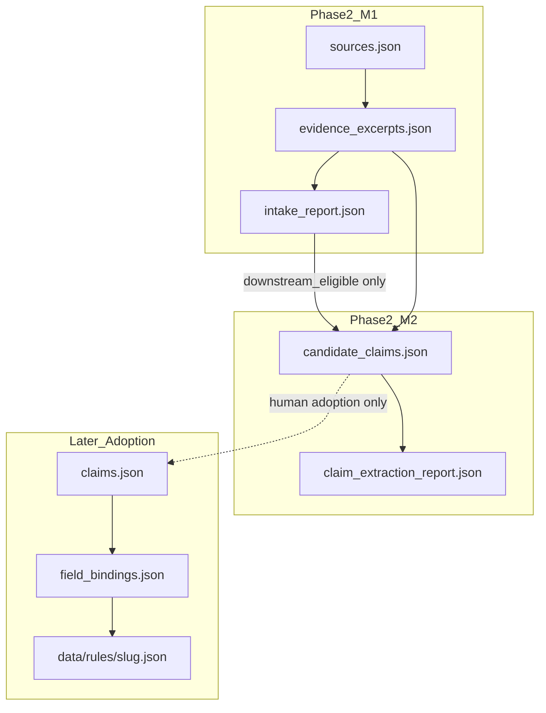

# Governed Country Pipeline — Phase 2 Milestone 2

**Branch:** `claude/governed-country-pipeline-p2-m2`  
**Status:** PLAN ONLY — awaiting architectural and governance review before implementation  
**Base:** `main` @ Phase 2 M1 merge (`9e7f79e79` / PR #65)  
**Date:** 2026-07-30  
**Depends on:** Phase 1 (Governed Review) + Phase 2 M1 (Source Intake + Evidence Excerpts)

---

## 1. Purpose

Convert **downstream-eligible evidence excerpts only** into **reviewable candidate claims**.

Governing rule:

> Claim extraction may restate supported meaning; it may not expand, reconcile, generalize, or operationalize beyond the evidence.

Opening posture:

> M2 produces reviewable candidate claims, not accepted project claims.

M2 does **not** write into `claims.json`, does **not** generate drafts or field bindings, and does **not** touch publication.

```text
downstream-eligible evidence excerpts
  → candidate claims
  → evidence-bound validation
  → human review
  → accepted / bounded / rejected   (human outcomes; not auto-written as project claims)
```

---

## 2. Explicit non-goals (hard boundaries)

| Forbidden | Reason |
|---|---|
| Draft / `data/rules/{slug}.json` generation or rewrite | Later adoption stage |
| Field-binding generation | Depends on accepted claims |
| Writing into `claims.json` | Adoption stage after human acceptance |
| Publication / indexing / lifecycle promotion | Human-gated |
| Automatic merge or PR creation | Out of scope |
| Source discovery or new evidence extraction | M1 territory |
| Unsupported legal interpretation | Violates containment |
| Multi-jurisdiction inference | Out of scope |
| Policy advice / recommendations | Forbidden claim types |
| Inventing weaker claims to paper over evidence gaps | Fake coverage |
| Multi-excerpt synthesis without explicit contract | Default **banned** in M2.0 |
| Turning official description into user instructions | Voice inflation |
| Elevating FAQ/guidance above its authority | Authority mismatch |
| Inferring absence of controls from silence | Negative-from-silence ban |
| Generalizing a scoped rule into a universal rule | Scope expansion |
| Using `bounded_paraphrase` as direct substrate without closed human review | M1 gate |
| Using non-downstream-eligible excerpts | M1 gate |

If an implementation PR touches any forbidden item, reject or split.

---

## 3. Success criterion (M2 closed loop)

```text
downstream-eligible excerpt(s)
  → atomic candidate claim
  → evidence links + transformation declaration
  → authority / scope / exception / temporal checks
  → deterministic structural PASS/BLOCK
  → human review required by default for meaning approval
```

**PASS means:** candidate claims comply structurally with the extraction contract.  
**PASS does not mean:** claims are legally or substantively approved.

Report must include:

```json
"semantic_approval": "not_established"
```

---

## 4. Artifacts

Under existing pack root:

```text
data/coverage/pipeline/{slug}/
  sources.json                 # read-only for M2
  evidence_excerpts.json       # read-only for M2
  intake_report.json           # read-only; used for eligibility cross-check
  candidate_claims.json        # NEW — authored/generated candidates
  claim_extraction_report.json # NEW — generated only
  # untouched by default:
  claims.json
  field_bindings.json
  review_report.json
```

### Roles

| File | Role |
|---|---|
| `candidate_claims.json` | Extraction output (candidates only) |
| `claim_extraction_report.json` | **Generated** — never hand-authored PASS |
| `claims.json` | Existing Phase 1 matrix; **adoption later**, not extractor write target |

---

## 5. Relationship to prior phases



No automatic wire from candidates → `claims.json` in M2.

---

## 6. `candidate_claims.json` contract

Top-level:

```json
{
  "schema_version": "1.0.0",
  "country_slug": "brazil",
  "generation_mode": "governed_extraction",
  "candidates": []
}
```

Each candidate (minimum):

```json
{
  "candidate_id": "CC-BR-FX-001",
  "claim_text": "Candidate factual statement",
  "claim_language": "en",
  "claim_type": "descriptive_rule",
  "scope": {
    "jurisdiction": "BR",
    "subject": "foreign_exchange",
    "actor": null,
    "transaction_context": null,
    "temporal_scope": "current"
  },
  "evidence_links": [
    {
      "excerpt_id": "EX-BR-…",
      "support_role": "direct"
    }
  ],
  "transformation": {
    "mode": "direct_restating",
    "normalizations": [],
    "omissions": [],
    "added_terms": []
  },
  "authority_posture": {
    "source_authority_level": "primary_law",
    "claim_voice": "statutory_description",
    "authority_preserved": true
  },
  "exception_handling": {
    "evidence_contains_exception": false,
    "exception_preserved": true,
    "exception_excerpt_ids": []
  },
  "support_status": "unreviewed",
  "human_review_required": false,
  "downstream_eligible": false
}
```

### Defaults (non-negotiable)

```json
{
  "support_status": "unreviewed",
  "downstream_eligible": false
}
```

Extractor must **not** auto-assign `supported` / `bounded` or promote `downstream_eligible: true`.  
Only closed human review may set:

- `support_status`: `supported` | `bounded` | `rejected` | …
- `downstream_eligible`: `true` (and only when support_status is an accepted terminal state)

---

## 7. Allowed claim types (narrow set)

Allowed in M2.0:

- `descriptive_rule`
- `threshold`
- `required_action`
- `permitted_action`
- `prohibited_action`
- `institutional_role`
- `regime_description`
- `documentation_requirement`
- `exception`
- `definition`

Forbidden in M2.0:

- `recommendation`
- `risk_assessment`
- `compliance_advice`
- `best_practice`
- `comparative_claim`
- `market_interpretation`
- `composite_summary`

---

## 8. Transformation modes

| Mode | Meaning | Default gate |
|---|---|---|
| `direct_restating` | Limited restatement of one official excerpt | Machine-structurally allowed |
| `faithful_translation` | Claim from reviewed translation path | Allowed if excerpt translation reviewed |
| `bounded_normalization` | Formal-only changes (names, ISO dates, currency codes, de-dupe, harmless word order) | Allowed if `normalizations[]` listed and no semantic `added_terms` |
| `single-source_composition` | Two+ excerpts from **same** official source → one claim | **Always** `human_review_required: true`, `downstream_eligible: false` until closed |
| `multi-source_synthesis` | Excerpts from two+ sources → one claim | **Banned in M2.0** (defer to M2.1 / M3) |

Any semantic `added_terms` beyond normalization allowlist → **BLOCK**.

---

## 9. Generation policy (M2.0 — no free generation)

Safe generator principle:

> **one eligible excerpt → zero or one candidate claim**

Not:

- one excerpt → many speculative claims  
- many excerpts → one synthesized claim  

Allowed substrate:

- Prefer `representation: verbatim_quote`
- Allow `faithful_translation` only when translation review is closed in M1
- **Ban** `bounded_paraphrase` as direct substrate by default

Generator must:

- record every normalization  
- not assign evidence grades  
- not decide publication readiness  
- not invent claims to fill gaps  

---

## 10. Core fidelity rules

### 10.1 Atomicity

One candidate = one independently evaluable proposition.

Forbidden compound example:

> Brazil uses a floating exchange-rate regime and travellers must declare cash above X.

Split into separate candidates.

Validator uses **heuristics only** (connectors, semicolons, dual normative clauses). Heuristics do not prove atomicity.

### 10.2 Evidence scope containment

Claim must not be broader than evidence on:

actor · transaction · currency · amount · direction · resident status · institution · jurisdiction · date · exception · legal force

Any expansion must appear in `added_terms`. Semantic additions → BLOCK.

### 10.3 Authority preservation

Claim voice must not exceed source authority.

Declare:

```json
"authority_posture": {
  "source_authority_level": "official_guidance",
  "claim_voice": "guidance_description",
  "authority_preserved": true
}
```

Block mismatches such as:

- FAQ → “law requires”
- guidance → “prohibited by statute”
- institutional description → “legally guaranteed”

unless a primary legal excerpt directly supports that force.

### 10.4 Evidence sufficiency

Every candidate needs ≥1 `evidence_links` entry with `support_role: "direct"`.

Roles:

- `direct` (required)
- `definition` / `scope` / `exception` / `temporal` / `authority` (supplemental only)

Supplemental roles never replace a missing direct link.

All linked excerpts must be downstream-eligible per M1 (`intake_report` / excerpt eligibility).

### 10.5 Exceptions

If evidence contains an exception/limitation:

```json
"exception_handling": {
  "evidence_contains_exception": true,
  "exception_preserved": true,
  "exception_excerpt_ids": ["EX-…"]
}
```

Dropping a material exception → BLOCK.  
If exception prevents atomicity: main claim + separate `exception` claim + `qualified_by` relation — main claim not downstream alone.

### 10.6 Negatives from silence

Forbidden to mint negative claims from absence of mention.

Negative claims require **affirmative** evidence supporting the negation.

### 10.7 Temporal posture

`scope.temporal_scope` ∈ `current` | `historical` | `effective_from` | `effective_until` | `unknown`

Not downstream-eligible if:

- source `currency` is `unknown` or `superseded`
- present-tense claim rests on historical-only evidence
- effective window unresolved for a `current` claim

---

## 11. Support status model

| Status | Who sets | Meaning |
|---|---|---|
| `unreviewed` | extractor default | Structurally present; meaning not approved |
| `needs_evidence` | human / validator | Missing sufficient direct support |
| `needs_human_review` | machine or human | Ambiguity / authority / composition |
| `supported` | **human only** | Accepted for later adoption consideration |
| `bounded` | **human only** | Accepted with narrowed wording |
| `rejected` | **human only** | Do not adopt |
| `superseded` | human | Obsolete candidate |

Machine path stops at structurally valid + `unreviewed` (or forced review flags).  
Semantic approval remains human.

---

## 12. Machine vs human guarantees

### Machine can prove

- IDs/schema completeness  
- excerpt/source linkage  
- excerpt downstream eligibility  
- no orphan links  
- allowed claim types / transformation modes  
- declared authority posture consistency (structural)  
- temporal field parseability  
- exception-preservation flags present when declared  
- report drift  
- milestone scope (no forbidden path edits)  

### Machine cannot alone prove

- full legal-meaning preservation  
- paraphrase/nuance safety  
- omission immateriality  
- composition/synthesis correctness  
- legal-term translation accuracy  
- sufficiency of source for broader context  

These remain human review.

---

## 13. Validators

### 13.1 `validate_claim_extraction.py`

Checks listed in §10–§11 plus:

- generated `claim_extraction_report.json` drift (`--check-drift`)  
- default `downstream_eligible: false` for unreviewed candidates  
- ban on `multi-source_synthesis` in M2.0  
- ban on paraphrase substrate by default  

### 13.2 Extend `validate_pipeline_milestone_scope.py`

When M2 paths change, allow:

- `candidate_claims.json`  
- `claim_extraction_report.json`  
- M2 policy/schema/validators/CI/docs/protocol  
- Brazil M2 pilot candidates/report  

Forbid:

- `claims.json`  
- `field_bindings.json`  
- `data/rules/**`  
- publication / indexing metadata  

Prefer total ban on rules/claims edits in the first M2 implementation PR.

### 13.3 Regression gates (must remain green)

```text
python scripts/validate_source_intake.py --check-drift
python scripts/validate_country_pipeline.py brazil
python scripts/validate_claim_extraction.py --check-drift
python scripts/validate_pipeline_milestone_scope.py --base origin/main
```

Any Phase 1 or M1 regression → BLOCK.

---

## 14. `claim_extraction_report.json` (generated)

```json
{
  "schema_version": "1.0.0",
  "country_slug": "brazil",
  "decision": "PASS",
  "semantic_approval": "not_established",
  "blocking_findings": [],
  "improvement_findings": [],
  "needs_human_review": [],
  "stats": {
    "candidate_claims_total": 0,
    "direct_restating": 0,
    "translation_based": 0,
    "bounded_normalization": 0,
    "human_review_required": 0,
    "downstream_eligible": 0
  },
  "summary": "CLAIM EXTRACTION PASS (structural only)"
}
```

CI regenerates and fails on drift. Editors never hand-write PASS.

---

## 15. Auto-correction (one cycle, non-semantic only)

Allowed:

- ID formatting  
- field ordering  
- missing derived stats  
- report regeneration  
- normalization metadata hygiene  
- whitespace / enum casing  

Forbidden auto-fix:

- claim wording  
- scope  
- authority level  
- exception wording  
- temporal posture  
- evidence selection  
- support status  
- downstream eligibility promotion  

---

## 16. Brazil pilot (implementation phase only)

Subset, not all excerpts at once: **3–5** direct candidates from separate categories, e.g.:

1. FX / institutional channel (Lei Art. 3)  
2. Rate / market operation wording (Lei Art. 2)  
3. Customs declaration threshold (Receita / Lei Art. 14)  
4. Optional: FX accounts eligibility header (Res. 277 Art. 69–70) — careful atomicity  

Constraints:

- one claim ← one excerpt  
- verbatim substrate only  
- no synthesis / paraphrase / superseded / ambiguous  
- no edits to `claims.json` or `data/rules/brazil.json`  

---

## 17. Policy sketch (`intake` companion → `claim_extraction` block)

Add to `data/governance/country_pipeline_policy.json`:

```json
{
  "claim_extraction": {
    "generation_mode": "one_eligible_excerpt_to_zero_or_one_claim",
    "allowed_claim_types": ["descriptive_rule", "threshold", "required_action", "permitted_action", "prohibited_action", "institutional_role", "regime_description", "documentation_requirement", "exception", "definition"],
    "allowed_transformation_modes": ["direct_restating", "faithful_translation", "bounded_normalization", "single-source_composition"],
    "banned_transformation_modes": ["multi-source_synthesis"],
    "require_direct_evidence_link": true,
    "default_support_status": "unreviewed",
    "default_downstream_eligible": false,
    "ban_paraphrase_substrate": true,
    "ban_negative_from_silence": true,
    "require_authority_posture": true,
    "fail_on_report_drift": true,
    "semantic_approval_default": "not_established",
    "max_auto_correct_cycles": 1
  }
}
```

---

## 18. Implementation order (after plan approval)

1. Plan-only merge / approval on this branch  
2. Executable `claim_extraction` policy + schema constants  
3. `validate_claim_extraction.py` + report writer + drift  
4. Extend milestone scope gate for M2 paths  
5. Bounded Brazil pilot candidates  
6. Protocol Appendix C  
7. Run Phase 1 + M1 + M2 gates  
8. Open M2 implementation PR  
9. **Stop** (no adoption into `claims.json` in same PR)

---

## 19. Implementation PR acceptance criteria

Merge only if:

- claim extraction validator PASS  
- report drift PASS  
- M1 intake PASS  
- Phase 1 Brazil staging PASS  
- milestone scope PASS  
- Governance Gate PASS  
- unexpected diff NONE  

PR body must state:

1. Scope  
2. Hard boundaries  
3. Machine-proven guarantees  
4. Human-only guarantees  
5. Brazil pilot results  
6. Explicit: **candidate claims are not published claims**

---

## 20. Review focus for this plan (four doors)

Before implementation approval, review only:

1. **Evidence sufficiency** — direct link rules; eligibility gate  
2. **Semantic containment** — no expansion beyond excerpt  
3. **Authority preservation** — voice ≤ source force  
4. **Downstream eligibility** — unreviewed candidates never auto-eligible  

Please return one of:

1. **APPROVE M2 PLAN** — proceed to bounded implementation  
2. **APPROVE WITH EDITS** — list required contract changes  
3. **BLOCK** — cite architectural/governance defect  

This commit is **plan only**. No executable M2 behavior is introduced yet.
