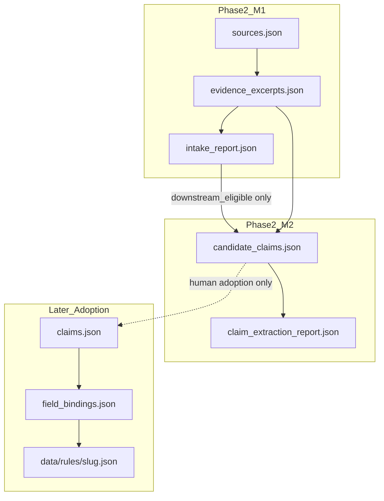

# Governed Country Pipeline — Phase 2 Milestone 2

**Branch:** `claude/governed-country-pipeline-p2-m2`  
**Status:** PLAN REVISED — contract edits from governance review incorporated; awaiting **APPROVE M2 PLAN** before implementation  
**Base:** `main` @ Phase 2 M1 merge (`9e7f79e79` / PR #65)  
**Date:** 2026-07-30  
**Depends on:** Phase 1 (Governed Review) + Phase 2 M1 (Source Intake + Evidence Excerpts)  
**Review decision addressed:** APPROVE WITH EDITS

---

## 1. Purpose

Convert **downstream-eligible evidence excerpts only** into **reviewable candidate claims**.

Governing rule:

> Claim extraction may restate supported meaning; it may not expand, reconcile, generalize, or operationalize beyond the evidence.

Opening posture:

> M2 produces reviewable candidate claims, not accepted project claims.

M2 does **not** write into `claims.json`, does **not** generate drafts or field bindings, and does **not** touch publication.

```text
downstream-eligible evidence excerpts
  → candidate claims
  → evidence-bound validation
  → semantic review (pending by default)
  → human close (supported / bounded / rejected)
  → optional downstream_eligible only after closed review + fingerprint match
```

---

## 2. Explicit non-goals (hard boundaries)

| Forbidden | Reason |
|---|---|
| Draft / `data/rules/{slug}.json` generation or rewrite | Later adoption stage |
| Field-binding generation | Depends on accepted claims |
| Writing into `claims.json` | Adoption stage after human acceptance |
| Publication / indexing / lifecycle promotion | Human-gated |
| Automatic merge or PR creation | Out of scope |
| Source discovery or new evidence extraction | M1 territory |
| Unsupported legal interpretation | Violates containment |
| Multi-jurisdiction inference | Out of scope |
| Policy advice / recommendations | Forbidden claim types |
| Inventing weaker claims to paper over evidence gaps | Fake coverage |
| `single_source_composition` | **Banned in M2.0** (defer to M2.1) |
| `multi_source_synthesis` | **Banned in M2.0** (defer to M2.1 / M3) |
| Turning official description into user instructions | Voice inflation |
| Elevating FAQ/guidance above its authority | Authority mismatch |
| Inferring absence of controls from silence | Negative-from-silence ban |
| Generalizing a scoped rule into a universal rule | Scope expansion |
| Using `bounded_paraphrase` as direct substrate without closed human review | M1 gate |
| Using non-downstream-eligible excerpts | M1 gate |
| Labeling cross-language extraction as `direct_restating` | Language/mode mismatch |

If an implementation PR touches any forbidden item, reject or split.

---

## 3. Success criterion (M2 closed loop)

```text
exactly one downstream-eligible excerpt
  → zero or one atomic candidate claim
  → evidence link + transformation + language-consistent mode
  → structural PASS/BLOCK
  → semantic_review_status: pending (default)
  → human close with fingerprint
  → downstream_eligible only if review closed and fingerprint matches
```

**PASS means:** candidate claims comply structurally with the extraction contract.  
**PASS does not mean:** claims are legally or substantively approved.

Report must include:

```json
"semantic_approval": "not_established"
```

---

## 4. Artifacts

```text
data/coverage/pipeline/{slug}/
  sources.json                 # read-only for M2
  evidence_excerpts.json       # read-only for M2
  intake_report.json           # read-only; eligibility cross-check
  candidate_claims.json        # NEW — generated and/or human-authored candidates
  claim_extraction_report.json # NEW — generated only
  # untouched by default:
  claims.json
  field_bindings.json
  review_report.json
```

| File | Role |
|---|---|
| `candidate_claims.json` | Candidate store (not accepted project claims) |
| `claim_extraction_report.json` | **Generated** — never hand-authored PASS |
| `claims.json` | Phase 1 matrix; adoption later only |

Every candidate must declare origin (edit #5):

```json
"origin": {
  "mode": "generated",
  "generator_version": "m2.0",
  "generated_at": "2026-07-30"
}
```

or:

```json
"origin": {
  "mode": "human_authored",
  "authored_by": "operator"
}
```

Human-authored candidates receive **no lighter gates** than generated ones.

---

## 5. Relationship to prior phases



---

## 6. Candidate object contract (revised)

```json
{
  "candidate_id": "CC-BR-FX-001",
  "candidate_text": "Generated or human-authored candidate wording",
  "reviewed_text": null,
  "claim_language": "pt",
  "claim_type": "descriptive_rule",
  "scope": {
    "jurisdiction": "BR",
    "subject": "foreign_exchange",
    "actor": null,
    "transaction_context": null,
    "temporal_scope": "current"
  },
  "evidence_links": [
    {
      "excerpt_id": "EX-BR-…",
      "support_role": "direct"
    }
  ],
  "transformation": {
    "mode": "direct_restating",
    "normalizations": [],
    "omissions": [],
    "added_terms": [],
    "translation_source": null
  },
  "authority_posture": {
    "source_authority_level": "primary_law",
    "claim_voice": "statutory_description",
    "authority_preservation_status": "unreviewed"
  },
  "exception_handling": {
    "evidence_exception_signal": "unknown",
    "exception_review_status": "pending",
    "exception_preserved": null,
    "exception_excerpt_ids": []
  },
  "origin": {
    "mode": "generated",
    "generator_version": "m2.0",
    "generated_at": "2026-07-30"
  },
  "semantic_review_status": "pending",
  "special_review_required": false,
  "support_status": "unreviewed",
  "downstream_eligible": false,
  "human_review": {
    "status": "pending",
    "reviewed_by": null,
    "reviewed_at": null,
    "decision": null,
    "reviewed_candidate_fingerprint": null,
    "notes": null
  }
}
```

### Defaults (non-negotiable)

```json
{
  "semantic_review_status": "pending",
  "special_review_required": false,
  "support_status": "unreviewed",
  "downstream_eligible": false,
  "human_review": { "status": "pending" },
  "authority_posture": { "authority_preservation_status": "unreviewed" },
  "exception_handling": { "exception_review_status": "pending" }
}
```

Do **not** use a lone `human_review_required: false` flag — it falsely implies meaning review is optional.

---

## 7. Language ↔ transformation mode (non-bypassable edit #1)

| Mode | Language rule |
|---|---|
| `direct_restating` | `claim_language` **must equal** the excerpt `source_language` (same-language restatement of `source_text`) |
| `faithful_translation` | `claim_language` **≠** source language; requires reviewed translation path |
| `bounded_normalization` | Same-language only; formal changes only |

Cross-language Portuguese → English **cannot** be `direct_restating`.

Required for translation candidates:

```json
"transformation": {
  "mode": "faithful_translation",
  "translation_source": {
    "excerpt_id": "EX-BR-…",
    "translation_review_status": "closed"
  }
}
```

Translation may rest on M1 `translation_text` only when that translation review is closed. Otherwise BLOCK.

Brazil pilot implication: Portuguese claims from Portuguese excerpts use `direct_restating`; English claims require `faithful_translation` + closed translation review.

---

## 8. Semantic review vs special review (edit #2)

| Field | Meaning |
|---|---|
| `semantic_review_status` | `pending` \| `closed` — **every** candidate starts `pending` |
| `special_review_required` | Extra review for ambiguity / authority risk / composition (composition banned in M2.0) / exception risk |

Meaning approval always requires semantic review close.  
`special_review_required: true` adds an exceptional queue item but does not replace semantic review.

---

## 9. Closed human review + fingerprint (non-bypassable edit #3)

```json
"human_review": {
  "status": "pending",
  "reviewed_by": null,
  "reviewed_at": null,
  "decision": null,
  "reviewed_candidate_fingerprint": null,
  "notes": null
}
```

On close:

```json
{
  "status": "closed",
  "reviewed_by": "operator-id",
  "reviewed_at": "2026-07-30",
  "decision": "supported",
  "reviewed_candidate_fingerprint": "sha256:…"
}
```

Fingerprint covers at least:

- `candidate_text`
- `reviewed_text` (if set)
- `scope`
- `evidence_links`
- `transformation`
- `authority_posture.source_authority_level` + `claim_voice`
- `exception_handling` material fields
- `claim_type` / `claim_language`

**Invalidation rule:**

> Any later change to claim wording (`candidate_text` / `reviewed_text`), scope, evidence links, or transformation invalidates the closed review and resets `human_review.status` to `pending`, `support_status` to `unreviewed`, and `downstream_eligible` to `false`.

Validator must recompute fingerprint and BLOCK stale closed reviews.

### Downstream eligibility promotion

`downstream_eligible: true` only if **all** hold:

1. `human_review.status == closed`
2. Fingerprint matches current candidate bytes
3. `support_status` ∈ {`supported`, `bounded`}
4. `semantic_review_status == closed`
5. `exception_review_status` closed for claim types that require it (at least required/prohibited/permitted; prefer all types in M2.0)
6. Linked excerpts remain M1 downstream-eligible
7. No banned transformation mode

Machine never auto-sets `downstream_eligible: true`.

---

## 10. Allowed claim types (unchanged narrow set)

Allowed: `descriptive_rule` · `threshold` · `required_action` · `permitted_action` · `prohibited_action` · `institutional_role` · `regime_description` · `documentation_requirement` · `exception` · `definition`

Forbidden: `recommendation` · `risk_assessment` · `compliance_advice` · `best_practice` · `comparative_claim` · `market_interpretation` · `composite_summary`

---

## 11. Transformation modes (M2.0 — edit #4)

| Mode | Allowed in M2.0? | Notes |
|---|---|---|
| `direct_restating` | Yes | Same language; one excerpt |
| `faithful_translation` | Yes | Cross-language; closed translation review |
| `bounded_normalization` | Yes | Formal-only; listed in `normalizations[]` |
| `single_source_composition` | **No** | Deferred to M2.1 |
| `multi_source_synthesis` | **No** | Deferred to M2.1 / M3 |

M2.0 generation rule:

> **one candidate ← exactly one direct excerpt**

Policy:

```json
"allowed_transformation_modes": [
  "direct_restating",
  "faithful_translation",
  "bounded_normalization"
],
"banned_transformation_modes": [
  "single_source_composition",
  "multi_source_synthesis"
]
```

---

## 12. Generation policy

> one eligible excerpt → zero or one candidate claim

Substrate:

- Prefer `verbatim_quote`
- Allow `faithful_translation` excerpt path only when translation review closed
- Ban `bounded_paraphrase` substrate by default

No free multi-claim speculation from one excerpt.  
No gap-filling weaker claims.

---

## 13. Core fidelity rules

### 13.1 Atomicity

One candidate = one independently evaluable proposition. Heuristic detection only.

### 13.2 Evidence scope containment

No expansion beyond evidence on actor / transaction / currency / amount / direction / residency / institution / jurisdiction / date / exception / legal force. Semantic `added_terms` → BLOCK.

### 13.3 Authority preservation (edit #6)

Replace boolean `authority_preserved: true` with:

`authority_preservation_status` ∈:

- `unreviewed` (default)
- `structurally_consistent` (machine may set)
- `human_confirmed` (human only)
- `mismatch` (machine or human)

Machine may detect known mismatches (FAQ→law requires, guidance→statutory prohibition, etc.) and set `mismatch` / BLOCK.  
Machine cannot alone prove full force preservation; `human_confirmed` is human-only.

### 13.4 Evidence sufficiency

≥1 `support_role: "direct"` link. Supplemental roles never replace direct. All excerpts must be M1 downstream-eligible.

### 13.5 Exceptions (edit #7)

```json
"exception_handling": {
  "evidence_exception_signal": "unknown",
  "exception_review_status": "pending",
  "exception_preserved": null,
  "exception_excerpt_ids": []
}
```

`evidence_exception_signal` ∈ `unknown` | `none_detected` | `present`

- Machine may set `none_detected` or `present` heuristically.
- Human closes: `none_confirmed` or `preserved` via `exception_review_status: closed` + notes/fields.
- Candidates are not downstream-eligible before exception review is closed (especially required/prohibited/permitted actions; M2.0 may require for all types).

Self-asserted `evidence_contains_exception: false` is insufficient.

### 13.6 Negatives from silence

Forbidden. Negation needs affirmative evidence.

### 13.7 Temporal posture

`current` | `historical` | `effective_from` | `effective_until` | `unknown`  
Not eligible if source superseded/unknown or tense/window inconsistent.

---

## 14. Bounded vs generated wording (edit #8)

Do not silently rewrite generated text.

| Field | Role |
|---|---|
| `candidate_text` | Immutable extraction/authoring wording (audit base) |
| `reviewed_text` | Null until human sets narrowed/approved wording |

On `bounded` decision:

```json
{
  "support_status": "bounded",
  "reviewed_text": "narrowed human-approved wording",
  "human_review": { "status": "closed", "decision": "bounded", "reviewed_candidate_fingerprint": "sha256:…" }
}
```

Fingerprint includes `reviewed_text` when present. Changing either text after close reopens review.

---

## 15. Support status model

| Status | Who sets |
|---|---|
| `unreviewed` | default |
| `needs_evidence` / `needs_human_review` | machine or human |
| `supported` / `bounded` / `rejected` / `superseded` | **human only** |

---

## 16. Machine vs human guarantees

### Machine can prove

Schema/IDs · excerpt eligibility · one-direct-excerpt rule · language↔mode consistency · banned modes absent · fingerprint freshness for closed reviews · report drift · milestone scope · structural authority mismatch heuristics · default pending review fields

### Machine cannot alone prove

Full legal-meaning preservation · nuance of translation · immaterial omissions · exception completeness in the wild · sufficiency for broader context

---

## 17. Validators

### `validate_claim_extraction.py`

All contracts above + `--check-drift` on `claim_extraction_report.json`.

### Extend `validate_pipeline_milestone_scope.py`

Allow M2 candidate/report/policy/schema/validators/docs.  
Forbid `claims.json`, `field_bindings.json`, `data/rules/**`, publication/indexing metadata.

### Regression

```text
python scripts/validate_source_intake.py --check-drift
python scripts/validate_country_pipeline.py brazil
python scripts/validate_claim_extraction.py --check-drift
python scripts/validate_pipeline_milestone_scope.py --base origin/main
```

---

## 18. Generated report

```json
{
  "schema_version": "1.0.0",
  "country_slug": "brazil",
  "decision": "PASS",
  "semantic_approval": "not_established",
  "blocking_findings": [],
  "improvement_findings": [],
  "needs_human_review": [],
  "stats": {
    "candidate_claims_total": 0,
    "direct_restating": 0,
    "translation_based": 0,
    "bounded_normalization": 0,
    "semantic_review_pending": 0,
    "downstream_eligible": 0
  },
  "summary": "CLAIM EXTRACTION PASS (structural only)"
}
```

---

## 19. Auto-correction

One cycle; non-semantic only (IDs, ordering, stats, report regen, casing/whitespace).  
Never auto-edit claim wording, scope, authority, exceptions, temporal posture, evidence selection, support status, or downstream eligibility.

---

## 20. Brazil pilot (implementation phase)

3–5 candidates, separate categories, **exact one direct excerpt each**.

- Prefer Portuguese `direct_restating` from Portuguese `verbatim_quote` excerpts  
- English candidates only with `faithful_translation` + closed translation review  
- No composition/synthesis/paraphrase/superseded/ambiguous  
- No `claims.json` / `data/rules/brazil.json` edits  

---

## 21. Policy sketch

```json
{
  "claim_extraction": {
    "generation_mode": "one_eligible_excerpt_to_zero_or_one_claim",
    "require_exactly_one_direct_excerpt": true,
    "allowed_claim_types": ["descriptive_rule", "threshold", "required_action", "permitted_action", "prohibited_action", "institutional_role", "regime_description", "documentation_requirement", "exception", "definition"],
    "allowed_transformation_modes": ["direct_restating", "faithful_translation", "bounded_normalization"],
    "banned_transformation_modes": ["single_source_composition", "multi_source_synthesis"],
    "direct_restating_requires_same_language": true,
    "faithful_translation_requires_closed_translation_review": true,
    "require_direct_evidence_link": true,
    "default_semantic_review_status": "pending",
    "default_support_status": "unreviewed",
    "default_downstream_eligible": false,
    "downstream_requires_closed_review_fingerprint": true,
    "ban_paraphrase_substrate": true,
    "ban_negative_from_silence": true,
    "authority_preservation_status_required": true,
    "exception_review_required_before_downstream": true,
    "fail_on_report_drift": true,
    "semantic_approval_default": "not_established",
    "max_auto_correct_cycles": 1
  }
}
```

---

## 22. Implementation order (after APPROVE M2 PLAN)

1. Sync from current `main`  
2. Executable `claim_extraction` policy + schema  
3. `validate_claim_extraction.py` + report + drift  
4. Extend scope gate  
5. Brazil pilot candidates (same-language preferred)  
6. Protocol Appendix C  
7. Run Phase 1 + M1 + M2 gates  
8. Open implementation PR  
9. Stop — no adoption into `claims.json`

---

## 23. Implementation PR acceptance

- M2 validator PASS · report drift PASS · M1 PASS · Phase 1 staging PASS · scope PASS · Governance Gate PASS · unexpected diff NONE  
- PR body states scope, boundaries, machine vs human guarantees, pilot results, and: **candidate claims are not published claims**

---

## 24. Non-bypassable corrections (this revision)

1. **`direct_restating` never crosses languages**; language change ⇒ `faithful_translation`.  
2. **Every candidate starts with `semantic_review_status: pending`** (no “no human review needed” default).  
3. **`downstream_eligible: true` requires closed human review bound to candidate fingerprint**.  
4. **Ban both `single_source_composition` and `multi_source_synthesis` in M2.0**.

Also incorporated: origin tagging, authority status model, exception signal independence, `candidate_text` vs `reviewed_text`.

---

## 25. Reviewer decision on this revised plan

Prior decision: **APPROVE WITH EDITS** — edits incorporated.

Please return one of:

1. **APPROVE M2 PLAN** — proceed to bounded implementation  
2. **APPROVE WITH EDITS** — further contract changes required  
3. **BLOCK** — cite remaining defect  

This revision is **plan only**. No executable M2 behavior is introduced in this commit.
